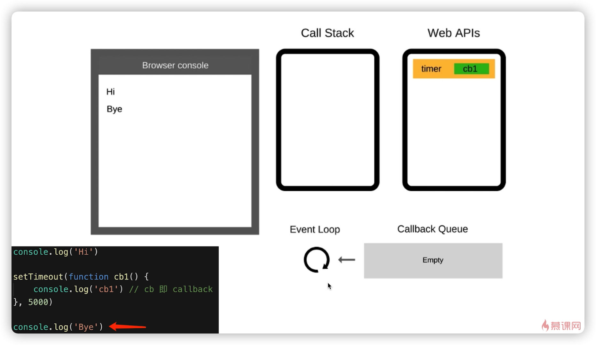
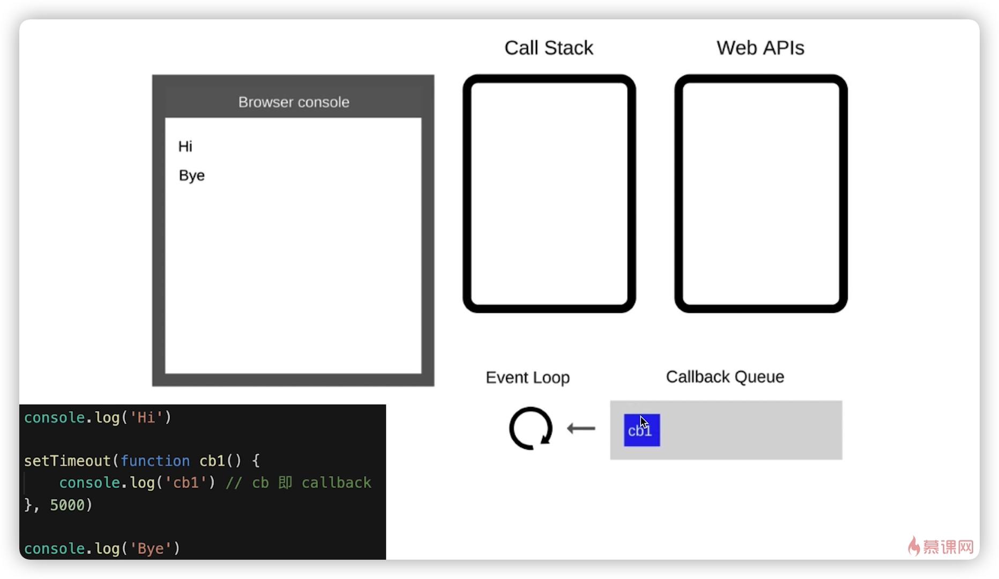
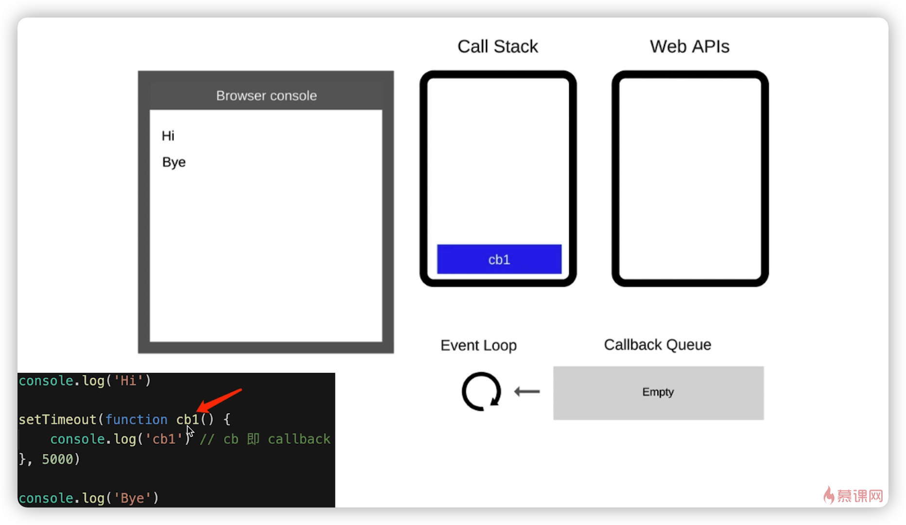
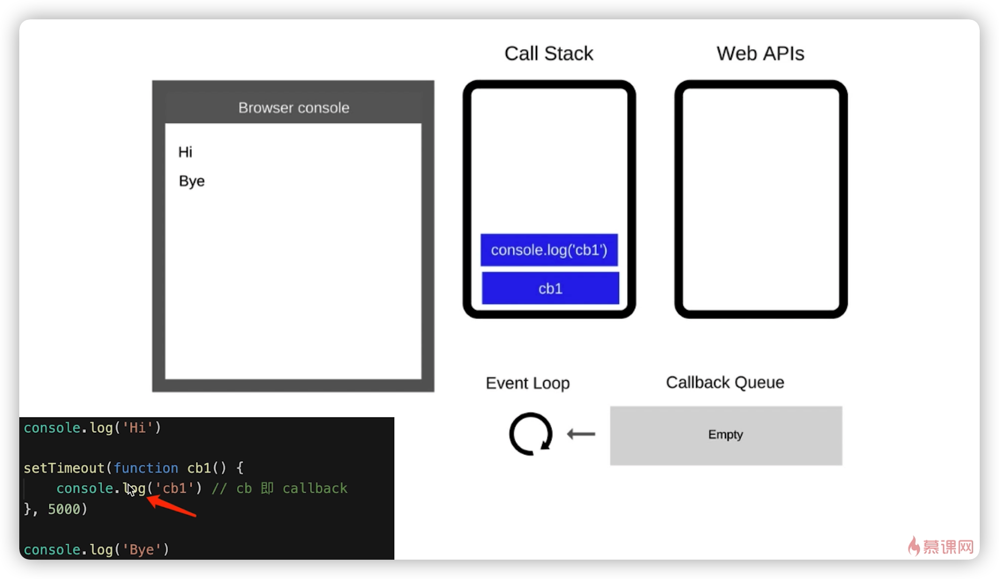
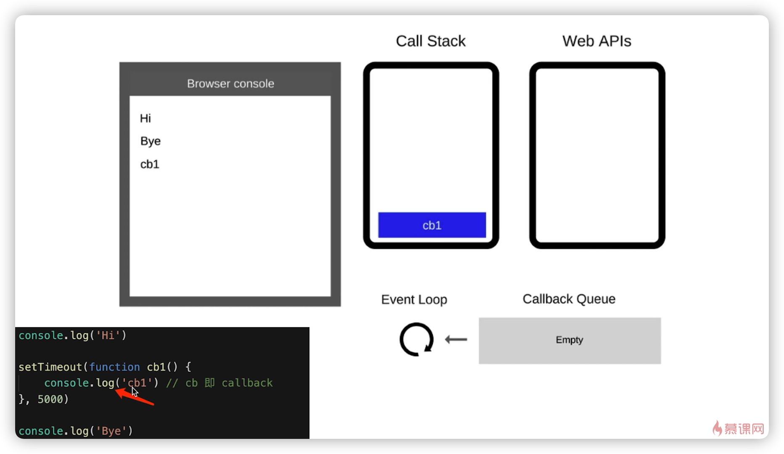
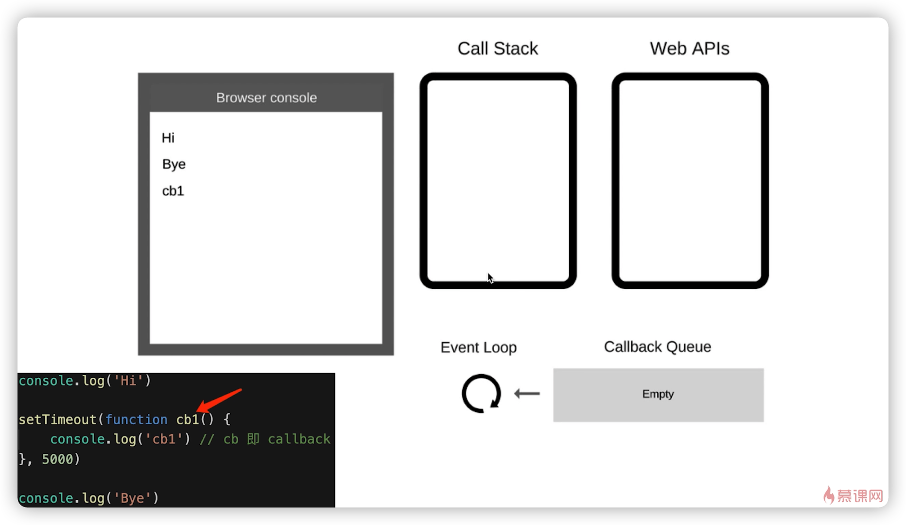

# JS异步 - 进阶 - 重点
## 题目
1. 请描述event lop(事件循环/事件轮询)的机制，可画图
2. 什么是宏任务和微任务，两者有什么区别
3. promise有哪三种状态？如何变化？
4. 场景题- promise then和catch的连接
## 1. event - loop(事件循环/事件轮询)
- JS是单线程 -> 异步要基于回调实现 -> event loop就是异步回调的实现原理
**event-loop概念**
```text
1. 同步代码，一行一行放在call Stack执行
2. 遇到异步，会’记录‘下，等待时机（定时、网络请求等）
3. 时机到了，就移动到Callback Queue
4. 如果Call Stack为空（即同步代码执行完）Event Loop开始工作
5. 轮询查找Callback Queue，如有则移动到Call Stack执行
6. 然后继续轮询查找（类似永动机）
```
```JS
console.log('Hi');

setTimeout(function cb1(){
    console.log('cb1'); // cb是cabllback
},5000)

console.log('Bye');
```







- DOM事件和event loop
  - JS是单线程的
  - 异步（setTimeout，ajax等）使用回调，基于event loop
  - DOM事件也使用回调，基于event loop
## 2. promise进阶
1. 三种状态
   1. pending、resolved、rejected
   2. pending -> resolved,pending -> rejected
   3. 状态变化不可逆
2. 状态的表现和变化
**状态变化**
```JS
const p1 = new Promise((resolve,rejected) => {

})

console.log('p1',p1);

const p2 = new Promise((resolve,rejected) => {
    setTimeout(() => {
        resolve()
    })
})

console.log('p2',p2); // pending 一开始打印时
setTimeout(() => console.log('p2-setTimeout',p2)); // resolved

const p3 = new Promise((resolve,rejected) => {
    setTimeout(() => {
        rejected()
    })
})
console.log('p3',p3);
setTimeout(() => console.log('p3-setTimeoout',p3)); // rejected
```
- **状态表现**
  - pending状态，不会触发then和catch
  - resolved状态，会触发后续的then回调函数， fulfilled
  - rejected状态，会触发后续的catch回调函数
```JS
const p1 = Promise.resolve(100); // fulfilled
// console.log('p1',p1);
p1.then(data => {
    console.log('data',data); // data 100
}).catch(err => {
    console.error('error',err)
})

const p2 = Promise.reject('err');
// console.log('p2',p2);
p2.then(data => {
    console.log('data2',data);
}).catch(err => {
    console.error('error2',err); // error2 err
})
```

3. then和catch对状态的影响
   1. then正常返回resolved，里面有报错则返回rejected
   2. catch正常返回resolved，里面有报错返回rejected
```JS
// then正常返回resolved，里面有报错则返回rejected
const p1 = Promise.resolve().then(() => {
    return 100;
})
console.log('p1',p1); // resolved 触发后续then回调
p1.then(() => {
    console.log('123'); // 执行then
})

const p2 = Promise.resolve().then(() => {
    throw new Error('new error')
})
console.log('p2',p2); // rejected 触发后续catch回调
p2.then(() => {
    console.log('456')
}).catch(err => {
    console.error('err100',err); // 执行catch
})

// catch正常返回resolved，里面有报错返回rejected
const p3 = Promise.reject('my error').catch(err => {
    console.error(err);
})
console.log('p3',p3); // resolved 注意 ，触发 then的回调
p3.then(() => {
    console.log(100);
})

const p4 = Promise.reject('my error').catch(err => {
    throw new Error('p4 error');
})
console.log('p4',p4); // rejected 触发 catch回调
p4.then(() => {
    console.log(200);
}).catch(() => {
    console.log('some error');
}) // resolved
```
### Promise题目解答
```JS
// > 第一题
Promise.resolve().then(() => {
    console.log(1) // 1
}).catch(() => {
    console.log(2)
}).then(() => {
    console.log(3) // 3
}) // resolved

// > 第二题
Promise.resolved.then(() => { // rejected
    console.log(1); // 1
    throw new Error('erro1')
}).catch(() => {
    console.log(2); // 2
}).then(() => {
    console.log(3); // 3
})

// > 第三题
Promise.resolve().then(() => { // rejected
    console.log(1); // 1
    throw new Error('error1');
}).catch(() => { // resolved
    console.log(2) // 2
}).catch(() => { // 这里是catch
    console.log(3)
})
```
## 3. async/await
**知识点**
1. 异步回调callback hell
2. Promise then catch链式调用，但也是基于回调函数
3. async/await是永不语法，彻底消灭回调函数

### 1. async/await基础使用
```JS
// async/await 基本使用
function loadImg(src){
    let p =  new Promise(
        (resolve,reject) => {
             const img = document.createElement('img');
             img.onload = () => {
                 resolve(img);
             }
             img.onerror = () => {
                 reject(new Error(`图片加载失败${src}`))
             }
             img.src = src;
        }
    )
    return p;
}

const url1 = `https://img4.sycdn.imooc.com/5cd2fa110001ce3007410555-140-140.jpg`
const url2 = `http://img4.sycdn.imooc.com/5a9fd02e00018e3308000751-160-160.jpg`

// await后可以追加async函数 或者 Promise
// async function loadImg1(){
//     const img1 = await loadImg(url1)
//     return img1
// }

// async function loadImg2(){
//     const img2 = await loadImg(url2)
//     return img2;
// }

!(async function() {
    // img1
    const img1 = await loadImg(url1);
    console.log(img1.height,img1.width);

    // img2
    const img2 = await loadImg(url2);
    console.log(img2.height,img2.width);
})()
```
### 2. async/await 和 Promise关系
- async/await是消灭异步回调
- async/await和Promise共同使用
  - 执行async函数，返回的是Promise对象
  - await相当于Promise的then
  - try...catch可以捕获异常，代替了Promise的catch
  - 执行async函数，返回的是一个Promise对象(是自动封装成的Promise对象)
```JS
// 执行async函数，返回的是一个Promise对象(是自动封装成的Promise对象)
async function fn1() {
    return 100;
}

const res1 = fn1();
console.log('res1',res1); // 返回Promise对象
res1.then(data => {
    console.log('data',data); // 100
})


// await相当于Promise then
!(async function (){
    const p1 = Promise.resolve(300);
    const data = await p1; // await相当于Promise then
    console.log('data',data); // 300 
})()

// 额外知识点，结合try...catch 来使用，进行捕获错误
!(async function(){
    const p4 = Promise.reject('err2'); // rejected 状态
    const res = await p4;
    console.log('res',res); // 这个地方不执行,解决不执行的方法，可以用try...catch来包裹进行捕获
})()

// await后面跟的值会自动封装成Promise
!(async function(){
    const data1 = await 400; // await Promise.resolve(400)
    console.log('data1',data1); // 400
})()


!(async function(){
    const data2 = await fn1();
    console.log('data2',data2);
})()


// try...catch
!(async function(){
    const p4 = Promise.reject('err1'); // rejected 状态
    try {
        const res = await p4
        console.log(res); // err1
    } catch(ex){
        console.error(ex); // try....catch 相当于promise的catch
    }
})()
```
### 3. 异步的本质
- async/await消灭了异步回调
- JS是单线程，但是必须有异步，还是要基于event loop
- async/await知识一个语法糖

```JS
// 第一题
async function async1 () {
    console.log('async1 start'); // 2
    await async2();
    // await 后面，都可以看做callback的内容，即异步
    // 类似event loop ,setTimeout(cb1)
    console.log('async1 end'); // 5
}

async function async2 () {
    console.log('async2'); // 3
}

console.log('script start'); // 1
async1();
console.log('script end'); // 4


// 第二题
async function async1 () {
    console.log('async1 start'); // 2  
    await async2();
    console.log('async1 end'); // 5
    await async3();
    console.log('async1 end 2'); // 7
}

async function async2 () {
    console.log('async2'); // 3
}

async function async3() {
    console.log('async3'); // 6
}

console.log('script start');  // 1
async1();
console.log('script end'); // 4

// 这一类的题目，主要要注意await会放到异步队列里
```
### 4. for...of
- for...in(以及forEach for)是常规的同步遍历
- for...of长用于异步的遍历
```JS
function muti(num){
    return new Promise(resolve => {
        setTimeout(() => {
            resolve(num * num);
        },1000)
    })
}

const nums = [1,2,3];

// forEach是同步执行
nums.forEach(async(i) => {
    const res = await muti(i);
    console.log(res);
})

// for...of是异步执行
!(async function () {
    for(let i of nums){
        const res = await muti(i);
        console.log(res);
    }
})()
```

### async/await总结
-   asycnc/await解决了异步回调，是一个语法糖
-   async/await和Promise相辅相成，相互依赖
-   for...of是异步执行了，而其他的循环都是同步执行的。
## 4. 微任务/宏任务
