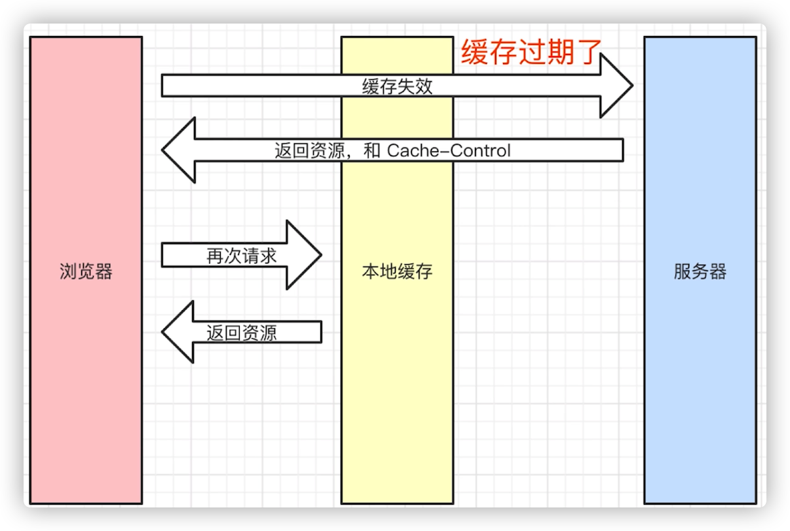
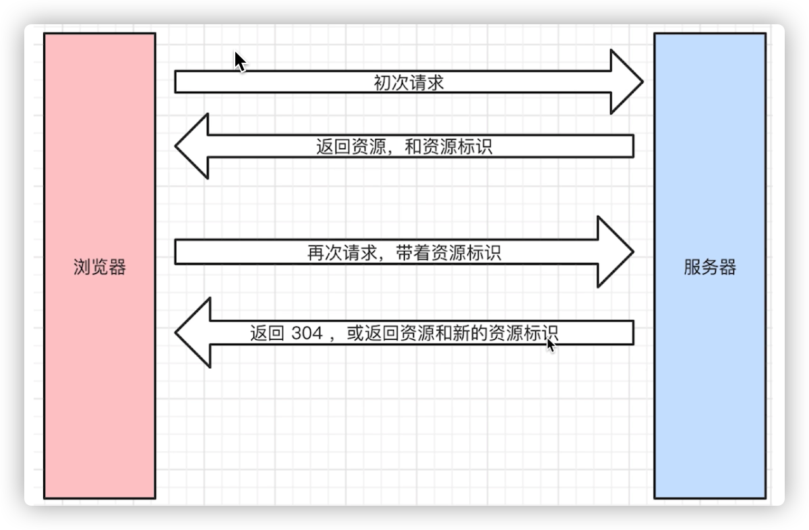
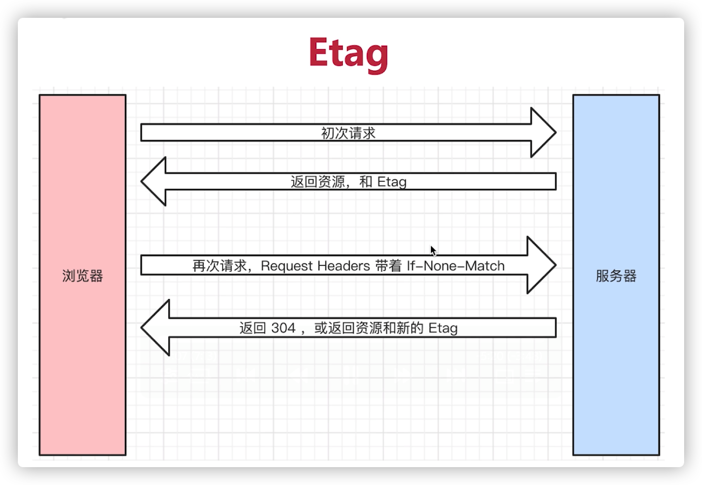
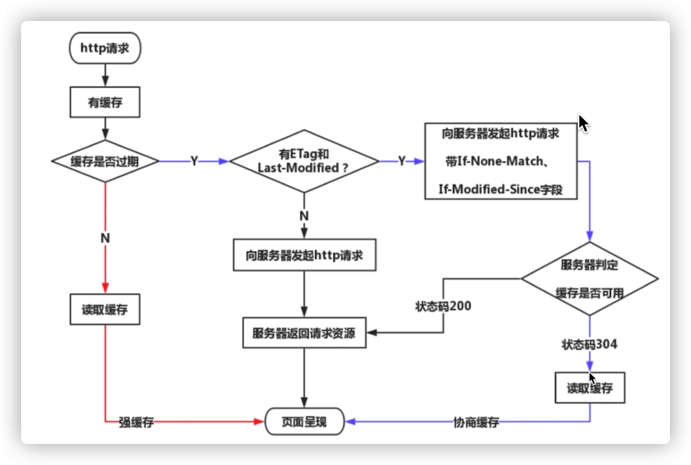

# http面试题
## 面试题
### 1. http常见状态码有哪些？
状态码分类，常见状态码，关于协议和规范
- **分类**
  - 1xx：服务器收到请求
  - 2xx: 请求成功，如200
  - 3xx: 重定向，如302
  - 4xx: 客户端错误，如404
  - 5xx: 服务端错误，如500
- **常见状态码**
  - 200：成功
  - 301：永久重定向（配合location，浏览器自动处理），适用于某网站想更换新的域名
  - 302：临时重定向（配合location，浏览器自动处理）
  - 304：资源未被修改
  - 404： 资源未找到
  - 403： 只没有权限
  - 500： 服务端错误
  - 504： 网关超时，服务器内部之间因为网络超时，而导致错误
### 2. http常见的header有哪些？
HTTP header（HTTP 首部，HTTP 头）表示在 HTTP 请求或响应中的用来传递附加信息的字段，修改所传递的消息（或者消息主体）的语义，或者使其更加精确。消息首部不区分大小写，开始于一行的开头，后面紧跟着一个 ':' 和与之相关的值。字段值在一个换行符（CRLF）前或者整个消息的末尾结束。

一个仅包含一个首部的请求：
```JS
GET /example.http HTTP/1.1
Host: example.com
```
重定向请求中必须包含 (Location) 首部：

302 Found
```text
Location: /NewPage.html
```

一些典型的首部：
304 Not Modified
```JS
Access-Control-Allow-Origin: *
Age: 2318192
Cache-Control: public, max-age=315360000
Connection: keep-alive
Date: Mon, 18 Jul 2016 16:06:00 GMT
Server: Apache
Vary: Accept-Encoding
Via: 1.1 3dc30c7222755f86e824b93feb8b5b8c.cloudfront.net (CloudFront)
X-Amz-Cf-Id: TOl0FEm6uI4fgLdrKJx0Vao5hpkKGZULYN2TWD2gAWLtr7vlNjTvZw==
X-Backend-Server: developer6！.webapp.scl3.mozilla.com
X-Cache: Hit from cloudfront
X-Cache-Info: cached
```

### 4. 描述一下http缓存机制（重要）
#### http强制缓存

服务端： 加Response Headers中，控制强制缓存的逻辑，例如Cache-Control:max-age=31536000(s)
- cache-control
  - max-age: 缓存最大时间
  - no-cache: 我们不用本地缓存，正常向服务端请求
  - no-store: 我们不用本地缓存，并且**不让**服务端的进行缓存
  - private: 只能允许最终用户进行缓存
  - public: 对中间路由或者其他机器可以进行缓存
- Expires
  - 同在Response Headers中
  - 同为控制缓存过期
  - 已经Cache-Control代替
#### 协商缓存
1. 服务端缓存策略，意思就是服务端来决定这个文件是否需要缓存，而不是缓存到服务端。 
2. 服务端判断客户端资源，是否和服务端资源一样
3. 如果第二步一致则**返回304**，否则**返回200和最新资源**

4. 资源标识
   1. Response Headers中，有两种
   2. Last-Modified资源最后修改时间
   3. Etag资源的唯一标识（是一个字符串，类似人指纹）
   4. **优先使用Etag**


#### http缓存总结

### 5. http methods & Restful API
- 传统的methods
  - get获取服务器的数据
  - post向服务器提交数据
  - 简单的网页就以上两种操作
- 现在的methods
  - get获取数据
  - post新建数据
  - patch/put更新数据
  - delete删除数据
- Restful API
  - 一种新的API设计方法（早已推广使用）
  - 传统的API设计：把每个url当做一个功能
    - 设计:/api/list?pageIndex=2
    - 传统用methods表示操作类型（传统AP）
  - Restful设计：把每个url当做一个唯一的资源
    - 尽量不用url参数
    - 用method表示操作类型
    - 设计: /api/list/2
    - post请求: /api/blog
    - patch请求:/api/blog/100
    - get请求： api/blog/100 
### 三种刷新操作
-  正常操作： 地址栏输入url，跳转链接，进后退
-  手动刷新： F5，点击刷新按钮，右击菜单刷新 
-  不同刷新操作，不同的缓存策略。
   -  正常操作：强制缓存有效，协商缓存有效
   -  手动刷新：强制缓存失效，协商缓存有效
   -  强制刷新: 强制缓存失效，协商缓存失效