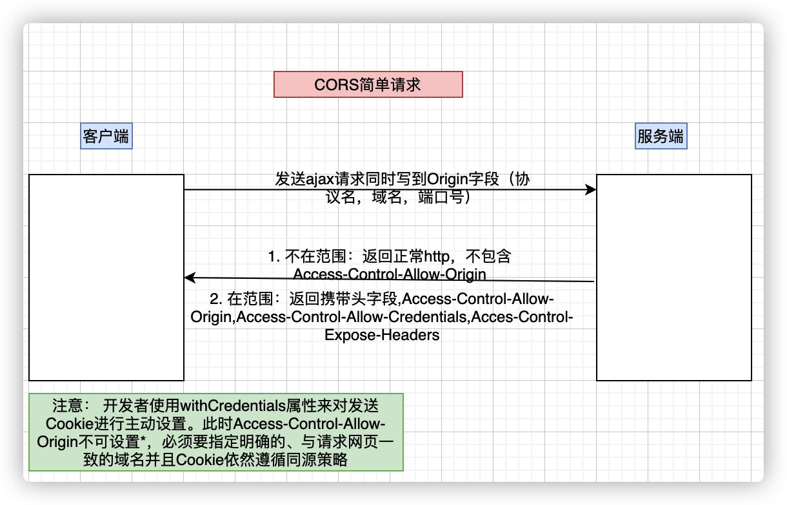
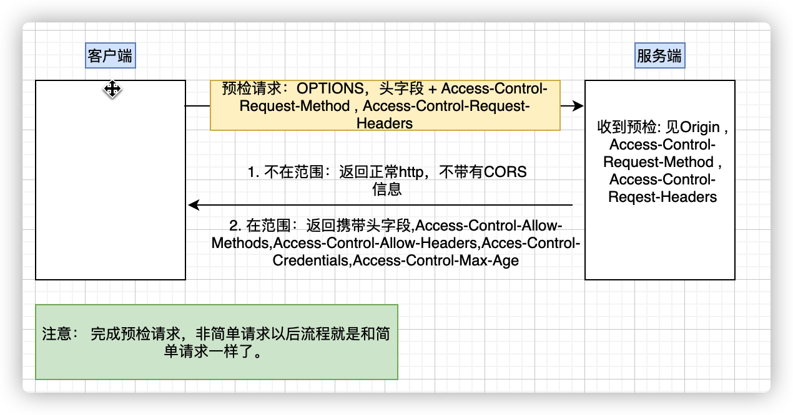

## CORS是什么
1. CORS是一个W3C标准，全称为“跨域资源共享”。
2. 它允许浏览器发送的XHR请求，接触同源限制。
3. 本质：CORS是使用自定义的HTTP头部允许浏览器和服务器相互了解,以确认请求或响应应该是成功还是失败。
## 为什么要有CORS
1. 浏览器为保护数据安全，在服务端开启了同源策略

### 同源策略
- 同源策略只协议名、域名、端口相同。
- 目的： 为了保证用户用户信息安全，防止恶意的网站窃取数据。
- 限制范围：
  - 无法读取非同源网页的 Cookie、LocalStorage 和 IndexedDB。
  - 无法接触非同源网页的 DOM。
  - 无法向非同源地址发送 AJAX 请求（可以发送，但浏览器会拒绝接受响应）。
### Cookie
- Cookie是服务器写入浏览器的一小段信息，只有同源的网页才能共享。
- 设置Cookie：两个网页一级域名相同，只是次级域名不同，浏览器允许通过设置document.domain共享 Cookie。注意： AB网站都需要同时设置document.domain属性。但是此方法对LocalStorage和IndexDB不可用。
- 设置Cookie的时候，可以将Cookie设置在一级域名，这样子域名都可以获得Cookie。
## CORS解决了什么问题
CORS让其即使不同源也可以访问数据信息，所以我们才叫它“跨域资源共享”。
## CORS的组成及过程
### 简单请求
**一图胜千言**

### 非简单请求
- 触发条件：PUT、DELETE、Content-Type:application/json
非简单请求的CORS请求，会在正式通信之前，增加一次HTTP查询请求，称为"预检"请求（preflight）。


> 字段信息解析
```text
> 简单请求

Access-Control-Allow-Origin: 该字段是必须的。它的值要么是请求时Origin字段的值，要么是一个*，表示接受任意域名的请求。

Access-Control-Allow-Credentials: 该字段可选。它的值是一个布尔值，表示是否允许发送Cookie。默认情况下，Cookie不包括在CORS请求之中。设为true，即表示服务器明确许可，Cookie可以包含在请求中，一起发给服务器。这个值也只能设为true，如果服务器不要浏览器发送Cookie，删除该字段即可。

Access-Control-Expose-Headers: 该字段可选。CORS请求时，XMLHttpRequest对象的getResponseHeader()方法只能拿到6个基本字段：Cache-Control、Content-Language、Content-Type、Expires、Last-Modified、Pragma。如果想拿到其他字段，就必须在Access-Control-Expose-Headers里面指定。

> 非简单请求

> 预检请求
Access-Control-Request-Method: 该字段是必须的，用来列出浏览器的CORS请求会用到哪些HTTP方法，例如是PUT。

Access-Control-Request-Headers: 该字段是一个逗号分隔的字符串，指定浏览器CORS请求会额外发送的头信息字段，例如是X-Custom-Header。

> 预检请求回应
Access-Control-Allow-Methods: 该字段必需，它的值是逗号分隔的一个字符串，表明服务器支持的所有跨域请求的方法。注意，返回的是所有支持的方法，而不单是浏览器请求的那个方法。这是为了避免多次"预检"请求。
Access-Control-Allow-Headers： 如果浏览器请求包括Access-Control-Request-Headers字段，则Access-Control-Allow-Headers字段是必需的。它也是一个逗号分隔的字符串，表明服务器支持的所有头信息字段，不限于浏览器在"预检"中请求的字段。

Access-Control-Allow-Credentials： 该字段与简单请求时的含义相同。

Access-Control-Max-Age： 该字段可选，用来指定本次预检请求的有效期，单位为秒。上面结果中，有效期是20天（1728000秒），即允许缓存该条回应1728000秒（即20天），在此期间，不用发出另一条预检请求。
```
