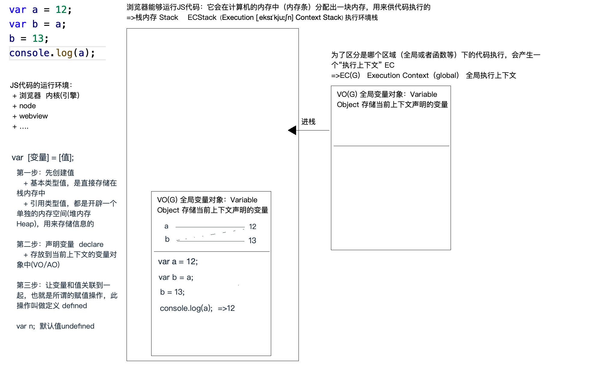
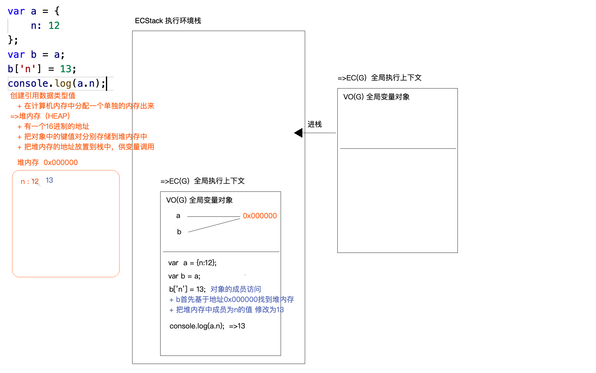
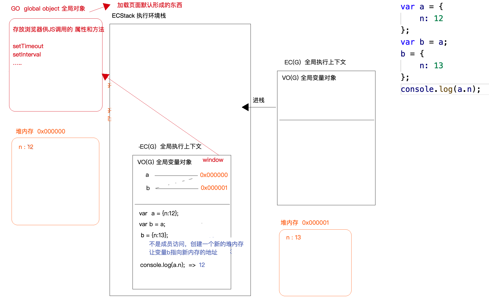

# JS中的数据类型
## 基本数据类型
- number
  - NaN
  - Infinity
- string
- boolean
- null
- undefined
- symbol
  - static Symbol
  - Symbol.prototype
- bigint
## 引用数据类型
- object
  - 普通对象
  - 数组对象
  - 正则对象
  - 日期对象
  - JSON对象
  - Set
  - Map
- function
  - 普通函数
  - 构造函数
  - 箭头函数
  - 生成器函数

## 知识点
> 1. typeof
```js
typeof 10 -> number
typeof NaN -> number
typeof "" -> string
typeof null -> undefined
typeof Symbol() -> symbol
typeof nul -> undefined
typeof undefined -> undefined
typeof {} or [] or /^$/  -> object
typeof function(){} -> function
```
> 2. Symbol()
- 特点
  - 唯一值
  - 不可被new,直接用Symbol()
- 用途（待学习）
  - 给对象设置唯一值
  - 在vuex和redux中做行为派发，统一管理派发的行为标识，标识值可以是唯一值。
> 3. bigInt
- MAX_SAFE_INTEGER
- MIN_SAFE_INTEGER
- 在数字后面加字母n就是bigInt
> 4. Infinity
```JS
Infinity === Infinity -> true
NaN === NaN -> false
-Infinity === Infinity -> false
isNaN() -> 判断是否为NaN
Object.is(NaN,NaN);
```  
### 执行上下文
- JS执行环境： 浏览器内核（引擎），node，webview
1. 浏览器想要执行代码，需要有执行环境栈，叫ECStack。
2. 为了区分是哪个区域下的代码执行，我们形成全局EC（G），并且自己的代码在自己的上下文中执行。
3. 在自己上下文中执行过程中，我们声明的变量会形成VO(G),全局变量对象中。
### 声明变量（遵循右侧先执行）
1. 先创建值，【基本类型值或者引用类型值（放到HEAP中）】
2. 声明变量，declare存放到当前上下文的变量对象中（V0/GO）
3. 让比变量和值关联到一起，也就是所谓的赋值操作，此操作叫做定义defined。
### 创建引用类型数据
+ 在计算机内存中分配一个单独的内存出来 => 堆内存（HEAP）
+ 有一个16进制的地址
+ 把对象中的键值对分别存储到堆内存中
+ 把堆内存的地址放到栈中，供变量调用
> 基本类型和引用类型的区别
+ 基本类型值直接放在栈内存中，直接按照值操作；
+ 引用类型值是开辟单独的堆内存存储信息的，操作的都是引用地址。
> GO: global object全局对象
+ 存放浏览器供JS调用的属性和方法,setTimeout,setInterval
+ GO -> window




