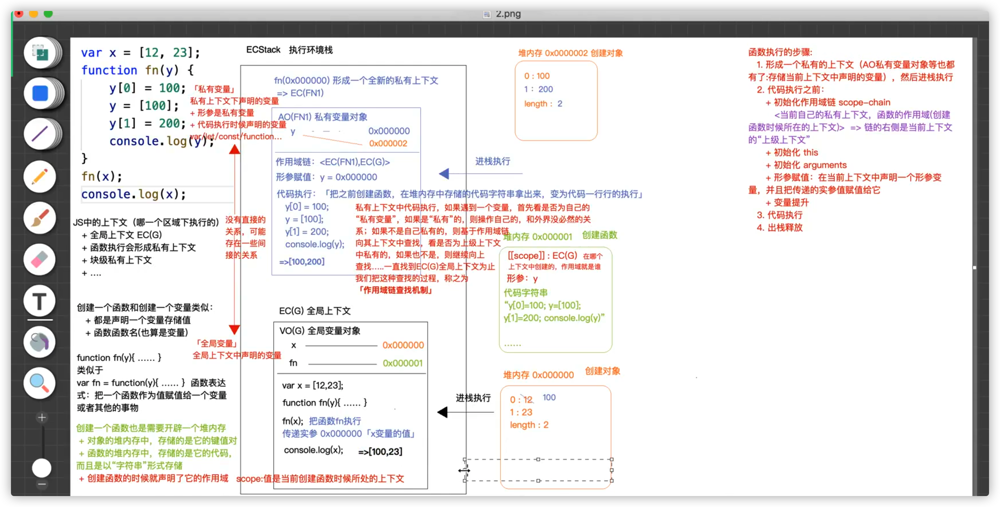
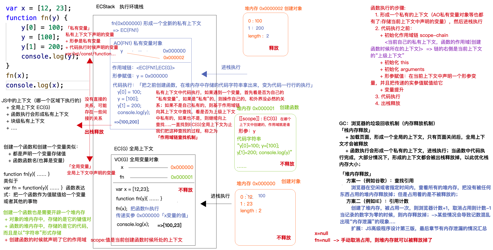

## 函数
### 1. JS中的上下文（哪一个区域执行的）
+ 全局上下文EC（G）
+ 函数执行会形成私有上下文
+ 块级私有上下文
+ 。。。。
  
### 2. 创建函数

- 创建一个函数和创建一个变量类似：
  - 都是声明一个变量存储值
  - 函数是函数名（也算是变量）
  - 创建一个函数也是需要开辟一个堆内存
    - 对象的堆内存中，存储的是他的键值对
    - 函数的堆内存中，存储的是它的代码，而且还是“**字符串**”形式存储
    - 创建一个函数的时候就声明了它的作用域 scope：值是当前创建函数时候所处的上下文。
- 函数执行
  - 1. 形成一个私有的上下文（AO私有变量对象），存储当前上下文中声明的变量，然后进栈执行
  - 2. 代码执行之前
    - 初始化作用域链 scope - chain , <当前自己的私有上下文，函数的作用域（创建函数时候所在的上下文）>，链的右侧是当前上下文的“上级上下文”
    - 初始化this
    - 初始化arguments
    - 形参赋值： 在当前上下文中声明一个形参变量，并且把传递的实参值赋值给它。
    - 变量提升
  - 3. 代码执行
    - 把之前创建函数在堆内存中存储的代码字符串拿出来，变成代码一行一行的执行。
    - 私有上下文中执行代码，如果遇到一个变量，首先看是否为自己的“**私有变量**”，如果是“**私有**”的，则操作自己的，和外接没有必然的关系；如果不是自己私有的，则基于作用域链向其上下文中查找，看是否为上级上下文中私有的，如果也不是，则继续向上查找.........一直找到EC(G)全局上下文为止，我们将这种查找的过程，称之为『**作用域链查找机制**』
  - 4. 出栈释放
- GC： 浏览器的垃圾回收机制（内存释放）「栈内存释放」
  - 加载页面，形成一个全局的上下文，只有页面关闭后，全局上下文才会被释放。
  - 函数执行会形成一个私有的上下文，进栈执行；当函数中代码执行完成，大部分情况下，形成的上下文都会被出栈释放掉，以此优化栈内存大小
    - 堆内存释放
      - 方法一（chrome）： **查找引用**
        - 浏览器在空闲或者指定时间内，查看所有的堆内存，把没有被任何东西占用的堆内存释放掉；但是占用着的是不被释放的。
      - 方法二（IE）：**引用计数**
        - 创建一个堆内存，被占用一次，则浏览器计数+1，取消占用则计数-1，当记录的数字为0的时候，则内存释放掉； -> 某些情况会导致计数混乱出现“内存泄漏”的现象，可参考高程4
