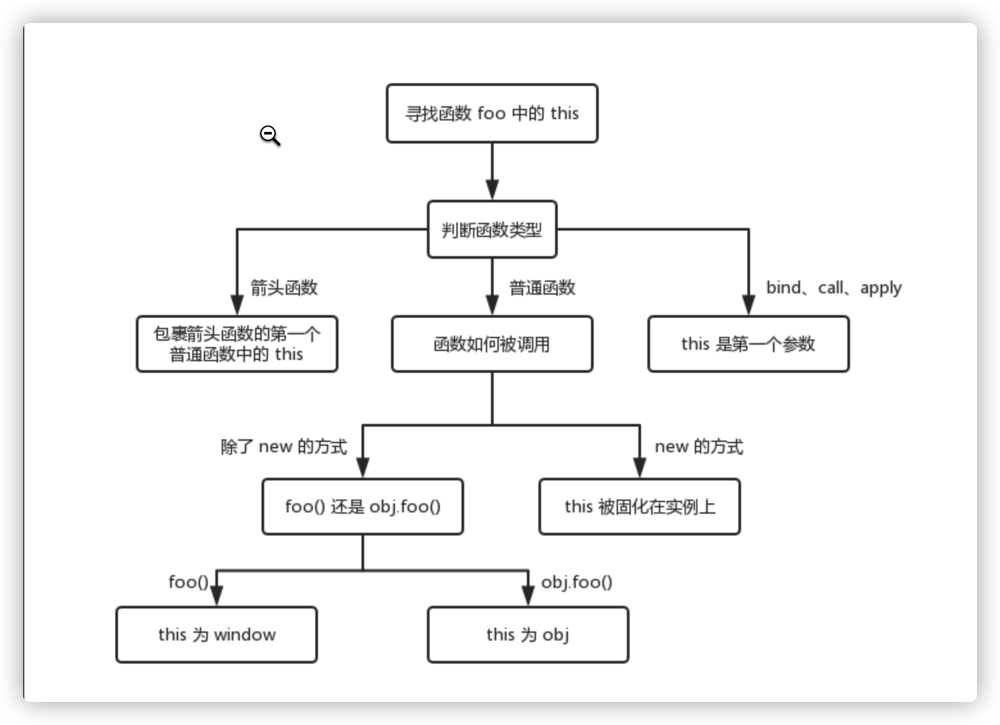

## this
- this函数的执行主体
  - 函数执行主体：谁把函数执行的
  - 函数执行上下文：在哪执行的
  - 规律：
    - 1. 事件绑定： 给当前元素的某个事件行为绑定方法，当事件触发、方法执行，方法中的this是当前元素本身
    - 2. 普通函数执行
        + 函数执行前面是否有“点”，没有“点”，this就是window（或者JS严格模式下是undefined）
        + 有“点”，“点”前面是谁this就是谁
        + 匿名函数(自执行函数/回调函数)如果没有经过特殊的处理，则this一般都是window/undefined，但是如果经过一些特殊处理，一切都以处理后的结果为主
