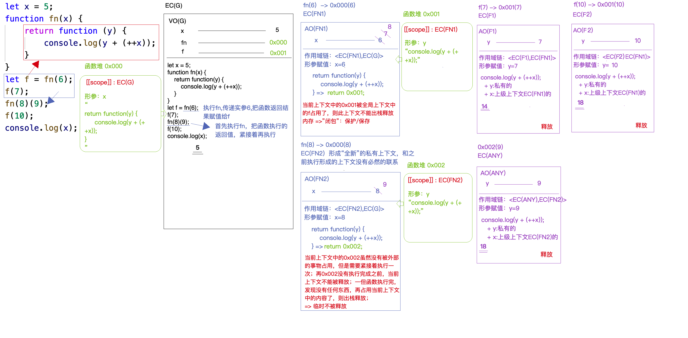

```JS
/**
 * 闭包作用域练习题1
 */

// ++x , x++ ，++放前面运算优先级高
let x = 5;

function fn(x) {
    return function (y) {
        console.log(y + (++x));
    }
}

let f = fn(6);
f(7); // 14
fn(8)(9); // 18
f(10); // 18
console.log(x); // 5
```



```JS
/**
 * 闭包原型链扩展二
 * 此题没有x参数，则使用x的时候根据作用域链去寻找到全局x，而且每次我们的++都会影响到全局的x
 * 
*/
let x = 5;

function fn() {
    return function (y) {
        console.log(y + (++x));
    }
}

let f = fn(6);
f(7); // 13
fn(8)(9); // 16 
f(10); // 18
console.log(x); // 8
```

```JS
/**
 * 闭包原型链练习题3
 * 
*/
let a = 0,
    b = 0;
function A(a){
    A = function(b){
        alert(a + b++);
    };
    alert(a++);
}
A(1); // alert(1) -> a++ = 2
A(2); // alert(4) -> b++ = 3
```
