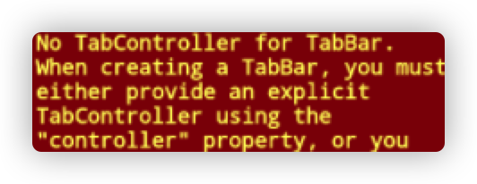
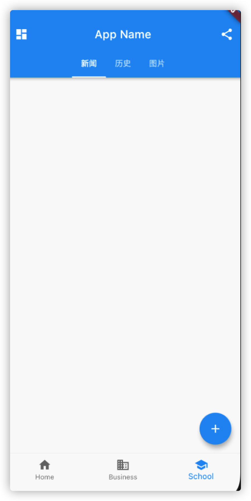

# [Flutter学习记录] TabBar、TabBarView与TabController：难舍难分

## 今日跟着flutter做demo，TabBar坑，大坑


```Dart
class _ScaffoldRouteState extends State<ScaffoldRoute>
    with SingleTickerProviderStateMixin {

  TabController _tabController; //需要定义一个Controller
  List tabs = ["新闻", "历史", "图片"];

  @override
  void initState() {
    super.initState();
    // 创建Controller  
    _tabController = TabController(length: tabs.length, vsync: this);
  }

  @override
  Widget build(BuildContext context) {
    return Scaffold(
      appBar: AppBar(
        ... //省略无关代码
        bottom: TabBar(   //生成Tab菜单
          controller: _tabController,
          tabs: tabs.map((e) => Tab(text: e)).toList()
        ),
      ),
      ... //省略无关代码
}
```
上述为书上源码，复制粘贴过去发现报错。



## 解决办法
我们来看一下Flutter的Widget生命周期


从图中我们可以看到，当flutter热重载的时候，不会走到initState初始化数据。
所以我们的错误在重启flutter项目就可以了，所以热重载没有作用。

