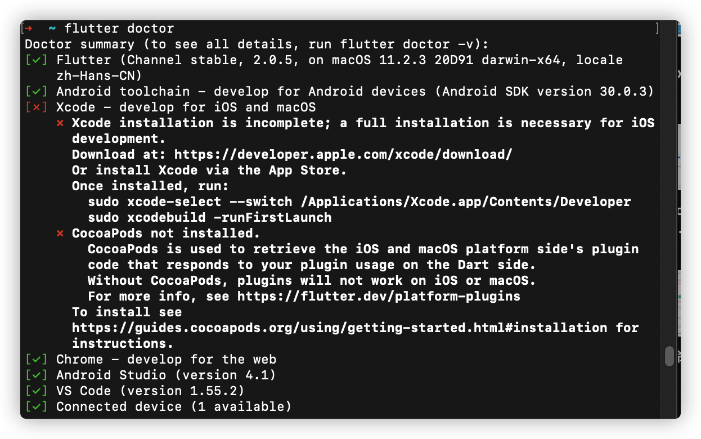
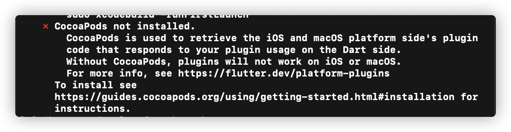
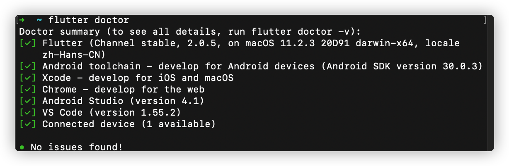
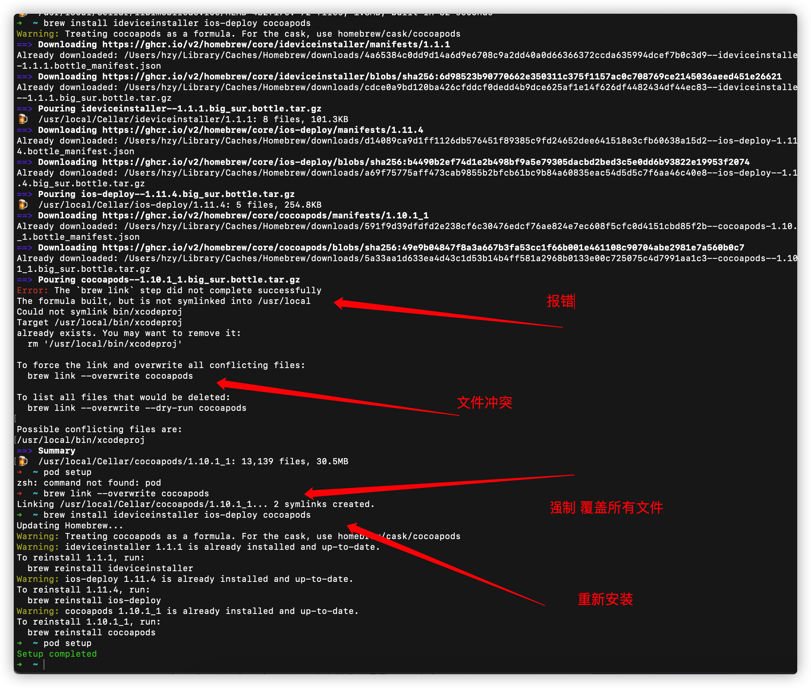

# flutter的安装

## MAC
[flutter安装文档](https://book.flutterchina.club/chapter1/install_flutter.html#_1-3-1-%E5%AE%89%E8%A3%85flutter)
- 建议随文档去安装flutter
- 额外需要安装两个软件
  - Android Studio 
  - Xcode -> 开发ios -> appstore下载
## 安装Xcode坑
没有坑，主要网速要快，编译器10G

## 安装Android Studio
**问题一**： 安装好以后会报错
```text
使用Android Studio出现unable to access android sdk add-on **list**
```
**解决方法**
```text
从访达的找到Android Studio应用 -> 右键显示包 -> 依次进入Contents/bin -> 修改idea文件在最后一行加入 disable.android.first.run=true
```


## 安装flutter中的坑
**问题一**：mac需要配置环境变量，根据文档的变量如果新的mac系统，默认为zsh交互。 
**解决方法**
```text
vi .zshrc
export PATH=/Users/hzy/Downloads/flutter/bin:$PATH
```
<br/>

**问题二**：在安装好flutter，我们使用flutter Doctor检测环境，会报错如下图所示：
    - 
**问题2-1**
**报错信息**
```text
Android toolchain - develop for Android devices (Android SDK version 28.0.3)
! Some Android licenses not accepted. To resolve this, run: flutter doctor
–android-licenses
```
**解决方法**
```text
flutter doctor --android-licenses


---------------------------------
Accept? (y/N): y
All SDK package licenses accepted
```

**问题2-2**
```text
Xcode - develop for iOS and macOS
✗ Xcode installation is incomplete; a full installation is necessary for iOS
development.
Download at: https://developer.apple.com/xcode/download/
Or install Xcode via the App Store.
Once installed, run:
sudo xcode-select --switch /Applications/Xcode.app/Contents/Developer
```
**解决办法**
```text
sudo xcode-select --switch /Applications/Xcode.app/Contents/Developer
sudo xcodebuild -license
```

**问题2-3**

**解决方法**
```text
sudo gem install cocoapods
```

**最终**


## 打开ios模拟器
终端
```text
open -a Simulator
```

## fluttershiyong 
创建项目
```text
flutter create my_app
```

## 将flutter写入真机
使用brew
```text
brew install --HEAD usbmuxd
brew link usbmuxd
brew install --HEAD libimobiledevice
brew install ideviceinstaller ios-deploy cocoapods
pod setup

// 注意安装过程中会有文件冲突， 按照终端报错去修改即可
```


## flutter的web端安装坑
[flutter-web构建](https://dart.dev/tutorials/web/get-started#4-create-a-web-app)
[flutter-web-issue](https://github.com/dart-lang/build/issues/1676)
**问题一**：主要集中在创建了工程以后，使用webdev serve会报错? 
**报错信息**: 
**解决方案**: 
1. 在Project目录中执行flutter packages pub global activate webdev
2. 再用webdev serve继续报错 Failed to precompile build_runner:build_runner:
3. 再次使用pub upgrade
4. 再webdev serve