## 思考题

思考题一：JS 分为哪两大类型？都有什么各自的特点？你该如何判断正确的类型？

基本类型 + 引用类型

思考题二：你理解的原型是什么？ 原型 → 原型链

思考题三：**bind**、call 和 apply 各自有什么区别？

思考题四：ES6 中有使用过什么？

思考题五：JS 是如何运行的？ Js → 单线程  → 进行与线程区别 → Eventloop → 微任务和宏任务 → 垃圾回收策略

## 1. 事件

- 事件三个阶段
- 事件注册
- 事件代理

## 2. 跨域 同源策略 跨域方式

涉及面试题：什么是跨域？为什么浏览器要使用同源策略？你有几种方式可以解决跨域问题？了解预检请求嘛？

## 3. CORS

注意字段：Access-Control-Allow-Origin

 1. **简单请求，非简单请求**

非简单： _预检 options

## 4. Vue生命周期

- 1. 初始化：events , lifecycle,relative ， Created
- 2. 模板编译: template → AST → renderFunction（stringify）
- 3. 挂载 → vnode → DOM真实替换 Mounted
- 4. 销毁

## 5. Vue组件通信

1. $emit
2. $refs → 子组件
3. vuex
4. eventBus

## 6. bind

一句话： bind方法会**创建**一个新的函数，当这个新函数被调动时，bind()第一个参数将作为它运行时的this，**之后的一序列参数**将会在传递的实参前传入作为它的参数。

**特点: 1. 返回一个函数 2. 可以传入参数**

```jsx
var foo = { value: 1};

function bar(){ console.log(this.value) };

// 返回一个函数
var bindFoo = bar.bind(foo);

bindFoo(); //1
```

**尝试模拟**

```jsx
Function.prototype.myBind = function(ctx, ...arr) {
    // 要绑定的this
    const context = ctx;
    // 原函数本身
    const _self = this;
    // 中间函数，为了建立新函数的原型对象与原函数原型对象的联系
    const middle = function() {};
    // 新函数
    const newF = function(...rest) {
            // 判断新函数的this在原型链是否能找到_self.prototype,新函数是否被当成构造函数执行
            const _this = this instanceof _self ? _self : context;
            const arg = [...arr, ...rest];
            arg.length > 0 ? _self.call(_this, ...arg) : _self.call(_this);
        }
        // 维护原型链,这样们才能用instanceof判断
    middle.prototype = _self.prototype;
    newF.prototype = new middle();
    return newF;
}

// 测试
function add(a, b, c) {
    var i = a + b + c;
    console.log(i);
    return i;
}

var func = add.myBind(undefined, 100);
func(1, 2); // 103

var fuc1 = add.bind(undefined, 200, 100);
fuc1(10); // 310
```

## 7. Vuex

**单项数据流：**

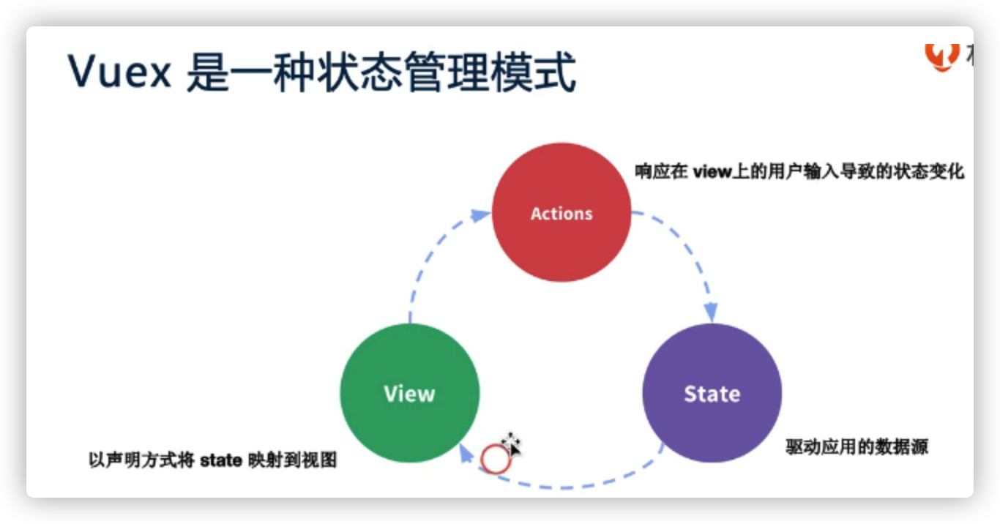

**使用场景：**多个组件共享同一数据

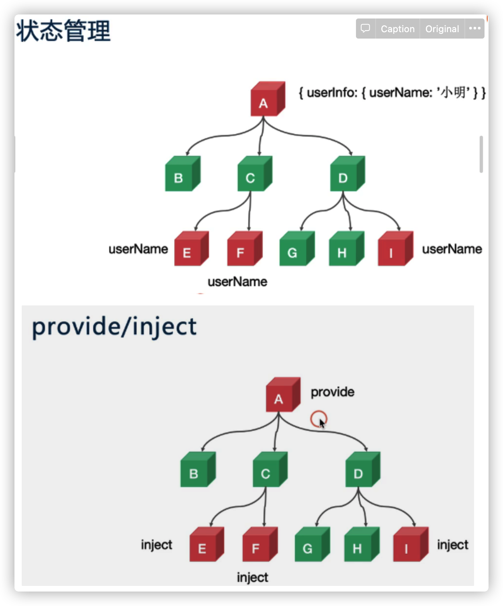

**Vuex运行机制**

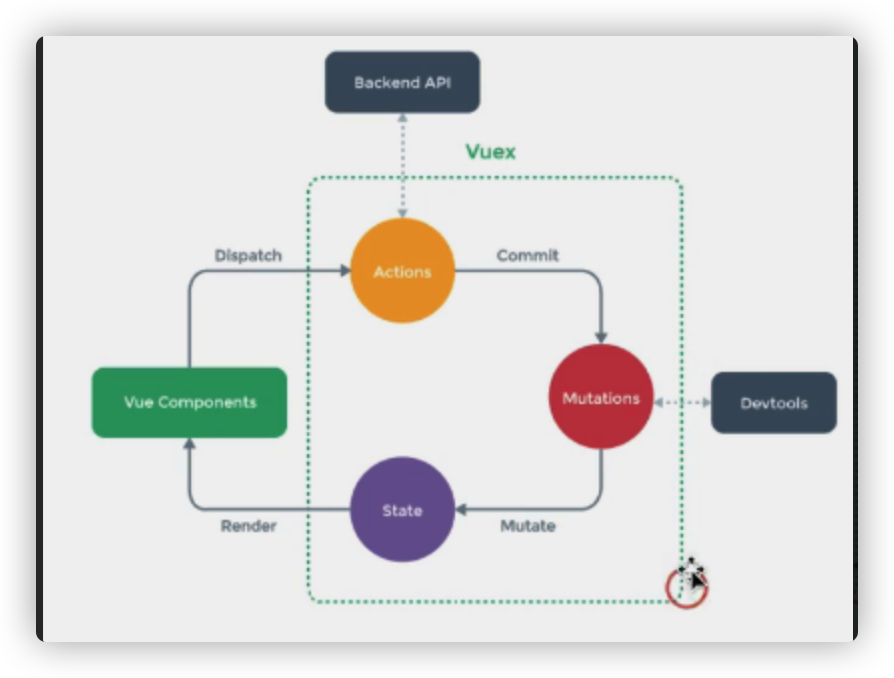

**Vue是通过什么方式提供响应式数据？**

## 在Vue中使用vue

```jsx
vue create vuex-demo
cd vuex-demo
npm i vuex
yarn serve
```

**$store是如何挂载到实例this上的**

### Vuex使用

1. /main.js

```jsx
import Vue from 'vue'
import Vuex from 'vuex';
import App from './App.vue'

// Vue使用Vuex
Vue.use(Vuex);
Vue.config.productionTip = false

// new Vuex使用Store
const store = new Vuex.Store({
    state: {
        count: 0
    },
		// 触发变更
    mutations: {
        increment(state) {
            state.count++
        }
    },
		// 异步执行时间
    actions: {
        increment({ state }) {
            setTimeout(() => {
                state.count++
            }, 3000)
        }
    },
    // 缓存数据
    getters: {
        doubleCount(state) {
            return state.count + 2
        }
    }
})

new Vue({
	// 每个new的Vue实例都有store挂载
    store,
    render: h => h(App),
}).$mount('#app')
```

2. /App.vue

```Vue
<template>
  <div id="app">
    {{count}}
    <br>
		<!-- vue中的getters类似于计算属性 -->
    {{$store.getters.doubleCount}}
		
		<!-- 直接触发事件更新 -->
    <button @click="$store.commit('increment')">count++</button>
		<!-- 异步的action事件，是vue用dispatch触发过来的 -->
    <button @click="$store.dispatch('increment')">count++</button>
  </div>
</template>

<script>

export default {
  name: 'App',
  computed:{
    count(){
			// 获取state上的count
      return this.$store.state.count
    }
  }
}
</script>

<style>
</style>
```

## 1. 核心概念

- State - this.$store.state.xxxx 取值
- Getter - this.$store.getters.xxx 取值
- Mutation - this.$store.commit('xxx') 赋值
- Action - this.$store.dispatch('xxx') 赋值
- Module

## 2.底层原理

- State : 提供一个响应式数据
- Getter：借助Vue的计算属性computed来实现缓存
- Mutation ： 更改state方法
- Action：触发mutation
- Module： Vue.set动态添加到state到响应式数据中

## 3. 简单的Vuex

```jsx
import Vue from 'vue';
const Store = function Store(options = {}) {
    const { state = {}, mutations = {} } = options;
    this._vm = new Vue({
        data: {
            $$state: state
        },
    })
    this._mutations = mutations;
};

Store.prototype.commit = function(type, payload) {
    if (this._mutations[type]) {
        this._mutations[type](this.state, payload);
    }
}

Object.defineProperties(Store.prototype, {
    state: {
        get: function() {
            return this._vm._data.$$state
        }
    }
});
export default { Store };

// 扩展简化版的min-vuex，实现getters并实现vuex的方式注入$store
```

## 4. Vuex最佳实践

- State - this.$store.state.xxx ——— mapState 取值
- Getter - this.$store.getters.xxx ———— mapGetters 取值
- Mutations - this.$store.commit("xxx") ——— mapMutations 赋值
- Action - this.$store.dispatch("xxx") ——— mapActions 赋值
- Module

**使用常量代替Mutatio事件类型：**

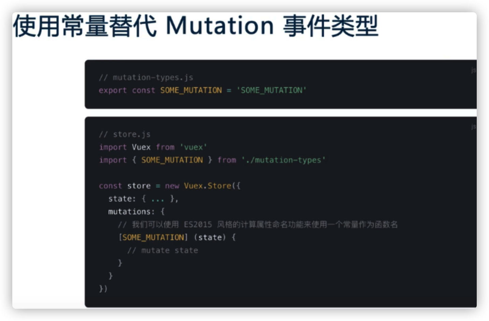

**Module**

- 开启命名空间 namespaced: true
- 嵌套模块不要过深，尽量扁平化
- 使用createNamespacedHelpers - 辅助函数(生成mapXXXX)


## Vue-router

### 解决的问题

- 监听URL变化，并在变化前后执行相应的逻辑
- 不同的URL对应不同的组件
- 提供多种方式改变URL的API（url改变不能导致浏览器刷新）

### 单页面（SPA开发模式）

- [www.xxx.com](http://www.xxx.com) ———— index.html
- [www.xxx.com/xxxx](http://www.xxx.com/xxxx) ——- index.html

### 使用方式

- 提供一个路由配置表，不同的URL对应不同组件的配置
- 初始化路由实例 new VueRouter()
- 挂载到Vue实例上
- 提供一个路由占位，用来挂载URL匹配到组件

### 路由模式

- Hash模式，丑，无法使用锚点定位
- History模式，需要后端配合，IE9不兼容（可以使用强制刷新）

```
const router = new VueRouter({
	mode: 'history', // history模式
	routes
)}
```

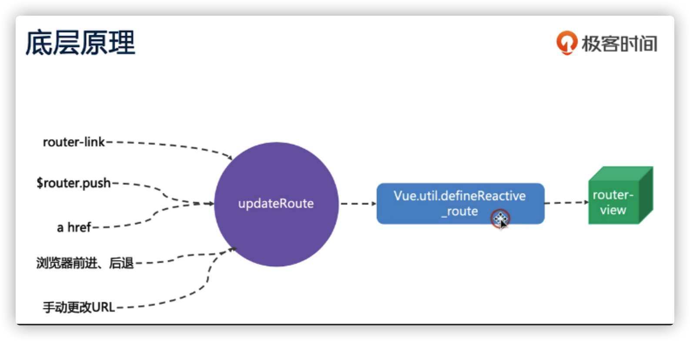

### Nuxt

1. SPA缺点
    - 不理由SEO     服务端渲染SSR
    - 首屏渲染时间长  预渲染 Prerendering
2. **Prerendering**
    - 适用于渲染静态站点， about.html , contact.html , xxx.html
3. SSR
    - 动态渲染
    - 配置繁琐
4. Nuxt
    - 静态站点
    - 动态渲染
    - 简化
5. SSR

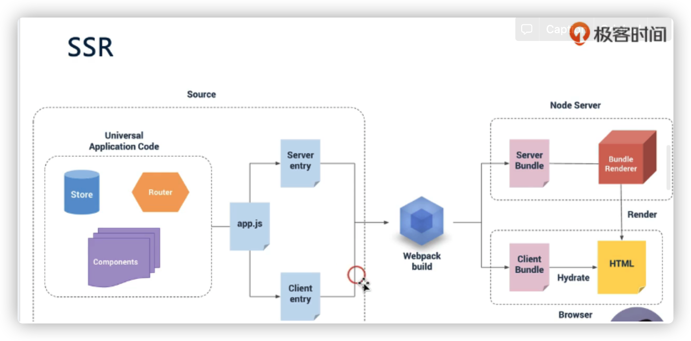

    Server entry： 服务端生成vue实例

    Client entry： 将vue实例挂载到DOM上

    webpack打包以后：升恒两个bundle文件

    Server Bundle：服务器在node上生成预渲染的Bundle → Render 完成初始的渲染

    Client Bundle： 将客户端的Bundle进行混合，将HTML给Vue管理，托管后面的动态DOM。

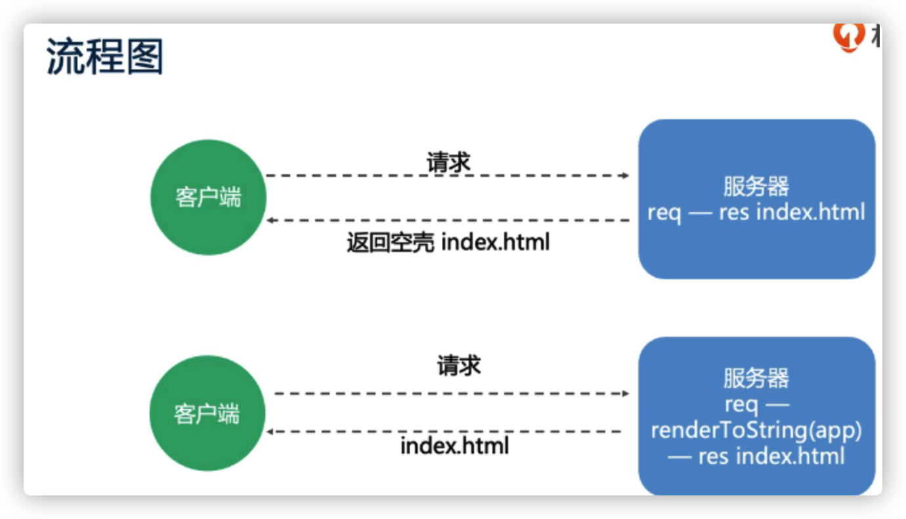

    ## 问题解决

    ### 1. Vuex是通过什么方式提供响应式数据的？

    - new Vue({})

    ### 2. 拓展简化版的min-vuex，实现getters，并实现Vuex的方法注入$store

    - 计算属性computed实现getters缓存
    - beforeCreate中混入$store的获取方式

    ### 3. 对于动态内容，如果不使用SSR，如何做SEO

    - 使用无头浏览器(phantomjs、headlessChrome)

# 浏览器缓存机制

## 总览：缓存机制

- 缓存位置
- 缓存策略
- 实际场景应用缓存策略

### 1. 缓存位置

**优先级**，当依次查找缓存且都没有命中的时候，才会去请求网络

1. **Service Worker**
2. **Memory Cache**
3. **Disk Cache**
4. **Push Cache**
5. **网络请求**

### **Service Worker**

可以让我们自由控制缓存哪些文件、如何匹配缓存、如何读取缓存，并且缓存是持续性的。

Service Worker 没有命中缓存的时候，我们需要去调用 fetch 函数获取数据。也就是说，如果我们没有在 Service Worker 命中缓存的话，会根据缓存查找优先级去查找数据。**但是不管我们是从 Memory Cache 中还是从网络请求中获取的数据，浏览器都会显示我们是从 Service Worker 中获取的内容。**

### **Memory Cache**

是内存中的缓存，读取内存中的数据比磁盘快。**但是内存缓存虽然读取高效，可是缓存持续性很短，会随着进程的释放而释放。**一旦我们关闭 Tab 页面，内存中的缓存也就被释放了。


当我们访问过页面以后，再次刷新页面，可以发现很多数据都来自于内存缓存

- 对于大文件来说，大概率是不存储在内存中的，反之优先
- 当前系统内存使用率高的话，文件优先存储进硬盘

### Disk Cache

Disk Cache 也就是存储在硬盘中的缓存，读取速度慢点，但是什么都能存储到磁盘中，比之 **Memory Cache 胜在容量和存储时效性上。**

在所有浏览器缓存中，Disk Cache 覆盖面基本是最大的。它会根据 HTTP Herder 中的字段判断哪些资源需要缓存，哪些资源可以不请求直接使用，哪些资源已经过期需要重新请求。**并且即使在跨站点的情况下，相同地址的资源一旦被硬盘缓存下来，就不会再次去请求数据。**

### Push Cache

Push Cache 是 HTTP/2 中的内容，当以上三种缓存都没有命中时，它才会被使用。**并且缓存时间也很短暂，只在会话（Session）中存在，一旦会话结束就被释放。**

- 所有的资源都能被推送，但是 Edge 和 Safari 浏览器兼容性不怎么好
- 可以推送 `no-cache` 和 `no-store` 的资源
- 一旦连接被关闭，Push Cache 就被释放
- 多个页面可以使用相同的 HTTP/2 连接，也就是说能使用同样的缓存
- Push Cache 中的缓存只能被使用一次
- 浏览器可以拒绝接受已经存在的资源推送
- 你可以给其他域名推送资源

### 网络请求

如果所有缓存都没有命中的话，那么只能发起请求来获取资源了。大部分接口都选择好了缓存策略。

### 缓存策略

强缓存和协商缓存 

1. 强缓存

强缓存可以通过设置两种 HTTP Header 实现：Expires 和 Cache-Control 。强缓存表示在缓存期间不需要请求，state code 为 200。

**Expires**

```
Expires: Wed, 22 Oct 2018 08:41:00 GMT
// Expires 受限于本地时间，如果修改了本地时间，可能会造成缓存失效。
```

**Cache-control**

```
Cache-control: max-age=30
// 优先级高于 Expires 。该属性值表示资源会在 30 秒后过期，需要再次请求。
// Cache-Control 可以在请求头或者响应头中设置，并且可以组合使用多种指令
```

多个指令配合使用图

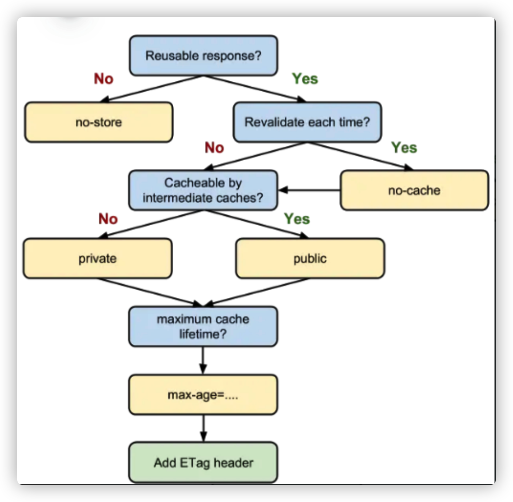
重点关注： no-store 、 no-cache、max-age

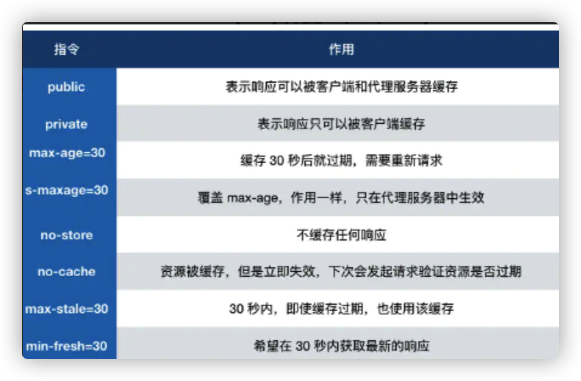
### 协商缓存

如果缓存过期了，就需要发起请求验证资源是否有更新。协商缓存可以通过设置两种 HTTP Header 实现：Last-Modified 和 ETag 。当浏览器发起请求验证资源时，如果资源没有做改变，那么服务端就会返回 304 状态码，并且更新浏览器缓存有效期。

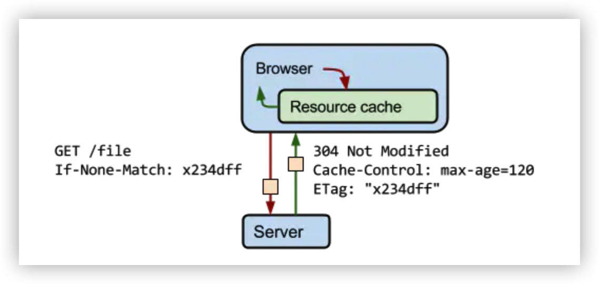
1. Last-Modified 和 If-Modified-Since

    Last-Modified 表示本地文件最后修改日期，If-Modified-Since 会将 Last-Modified 的值发送给服务器，询问服务器在该日期后资源是否有更新，有更新的话就会将新的资源发送回来，否则返回 304 状态码。

    Last-Modified 存在一些弊端

    - 如果本地打开缓存文件，即使没有对文件进行修改，但还是会造成 `Last-Modified` 被修改，服务端不能命中缓存导致发送相同的资源
    - 因为 `Last-Modified` 只能以秒计时，如果在不可感知的时间内修改完成文件，那么服务端会认为资源还是命中了，不会返回正确的资源
    - 这些弊端导致了HTTP/1.1出现了ETag

2.**产物** **ETag 和 If-None-Match**

ETag 类似于文件指纹，If-None-Match 会将当前 ETag 发送给服务器，询问该资源 ETag 是否变动，有变动的话就将新的资源发送回来。并且 ETag 优先级比 Last-Modified 高。

### 实际场景应用缓存策略

1. **频繁变动的资源**

对于频繁变动的资源，首先需要使用 Cache-Control: no-cache 使浏览器每次都请求服务器，然后配合 ETag 或者 Last-Modified 来验证资源是否有效。这样的做法虽然不能节省请求数量，但是能显著减少响应数据大小。

 2. **代码文件**

代码使用工具打包，我们对文件名进行**哈希**处理，只有当代码修改后才会生成新的文件名。基于此，我们就可以给代码文件设置缓存有效期一年 Cache-Control: max-age=31536000，只有当 HTML 文件中引入的文件名发生了改变才会去下载最新的代码文件，否则就一直使用缓存。

# 浏览器渲染

### 1. 浏览器将HTML文件转换成DOM树过程

字节数据 → 字符串 → Token → Node → DOM

### 2. 将 CSS 文件转换为 CSSOM 树

字节数据 → 字符串 → Token → Node → CSSOM

```html
<div>
  <a> <span></span> </a>
</div>
<style>
  span {
    color: red;
  }
  div > a > span {
    color: red;
  }
</style>

// 第一种设置样式的方式来说，浏览器只需要找到页面中所有的 span 标签然后设置颜色
// 第二种设置样式的方式来说，浏览器首先需要找到所有的 span 标签，然后找到 span 标签上的 a 标签，最后再去找到 div 标签.
// 然后给符合这种条件的 span 标签设置颜色，这样的递归过程就很复杂。
```

### 3. 生成渲染树

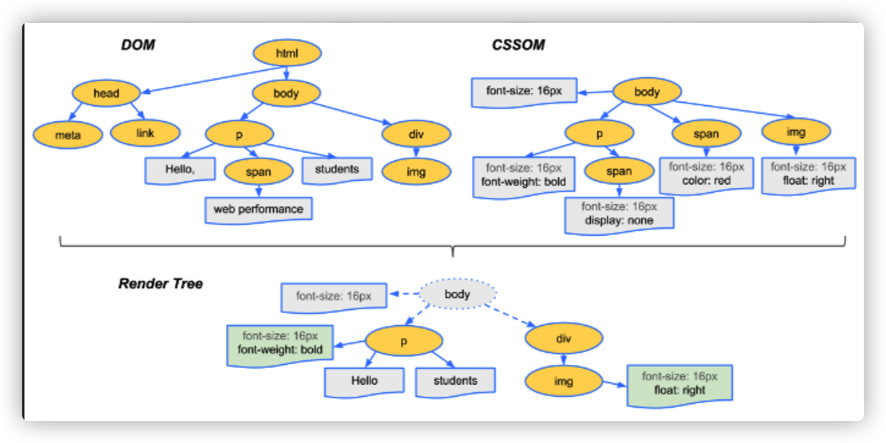
渲染树只会包括需要显示的节点和这些节点的样式信息，如果某个节点是 display: none 的，那么就不会在渲染树中显示。当浏览器生成渲染树以后，就会根据渲染树来进行布局（也可以叫做回流），然后调用 GPU 绘制，合成图层，显示在屏幕上。

### 4. 为什么操作 DOM 慢

这种技术的原理就是只渲染可视区域内的内容，非可见区域的那就完全不渲染了，当用户在滚动的时候就实时去替换渲染的内容。

```html
经典面试题：插入几万个 DOM，如何实现页面不卡顿？
// 方法一。requestAnimationFrame 的方式去循环的插入 DOM
// 方法二。其实还有种方式去解决这个问题：虚拟滚动（virtualized scroller）。
// 方法三。文档片段（最好不说）
```

### 5.  什么情况阻塞渲染

- script加载慢，解决： 将script引入放在标签底部，或者添加defer或async属性
- derfer： JS 文件会并行下载，HTML 解析完成后顺序执行，所以对于这种情况你可以把 script 标签放在任意位置。
- async： 没有任何依赖的 JS 文件可以加上 async 属性，表示 JS 文件下载和解析不会阻塞渲染。

### 6. 重绘（Repaint）和回流（Reflow）

**概念：**

- 重绘是当节点需要更改外观而不会影响布局的，比如改变 `color` 就叫称为重绘
- 回流是布局或者几何属性需要改变就称为回流。
- 回流必定会发生重绘，重绘不一定会引发回流

**动作导致性能问题：**

- 改变 `window` 大小
- 改变字体
- 添加或删除样式
- 文字改变
- 定位或者浮动
- 盒模型

**减少重绘和回流**

- 使用 transform 替代 top
- 使用 visibility 替换 display: none ，因为前者只会引起重绘，后者会引发回流（改变了布局）
- 不要把节点的属性值放在一个循环里当成循环里的变量

```JS
for(let i = 0; i < 1000; i++) {
    // 获取 offsetTop 会导致回流，因为需要去获取正确的值
    console.log(document.querySelector('.test').style.offsetTop)
}
```

- 不要使用 table 布局，可能很小的一个小改动会造成整个 table 的重新布局
- 动画实现的速度的选择，动画速度越快，回流次数越多，也可以选择使用 requestAnimationFrame
- CSS 选择符从右往左匹配查找，避免节点层级过多
- 将频繁重绘或者回流的节点设置为图层，图层能够阻止该节点的渲染行为影响别的节点。比如对于 video 标签来说，浏览器会自动将该节点变为图层。常用属性可以生成新图层，will-change和video、iframe 标签

**关键渲染路径**

DOMContentLoaded 事件后，就会生成渲染树，生成渲染树就可以进行渲染了

提示如何加速：

1. 从文件大小考虑
2. 从 `script` 标签使用上来考虑
3. 从 CSS、HTML 的代码书写上来考虑
4. 从需要下载的内容是否需要在首屏使用上来考虑

# 安全

## XSS

持久型和非持久型

**持久型**： 写入数据库中

**非持久型：** 一般通过修改 URL 参数的方式加入攻击代码，诱导用户访问链接从而进行攻击。chrome可以自己防御此类攻击。

**转义字符：** 对于用户的输入应该是永远不信任的。采用**白名单过滤**。

**Cookie**：cookie 字段带上HttpOnly，那么cookie只能通过 HTTP 协议传输，不能通过 JS 访问。

**CSP**

- 本质上就是建立白名单，开发者明确告诉浏览器哪些外部资源可以加载和执行。我们只需要配置规则，如何拦截是由浏览器自己实现的。我们可以通过这种方式来尽量减少 XSS 攻击。
- **开启 CSP**
    - 设置 HTTP Header 中的 Content-Security-Policy
    - 设置 meta 标签的方式 <meta http-equiv="Content-Security-Policy">

**HTTP Header举例：**

```text
只允许加载本站资源
Content-Security-Policy: default-src ‘self’

只允许加载 HTTPS 协议图片
Content-Security-Policy: img-src https://

允许加载任何来源框架
Content-Security-Policy: child-src 'none'

详情： https://developer.mozilla.org/en-US/docs/Web/HTTP/Headers/Content-Security-Policy
```

## CSRF

1. **防范 CSRF 攻击可以遵循以下几种规则：**
    1. Get 请求不对数据进行修改
    2. 不让第三方网站访问到用户 Cookie
    3. 阻止第三方网站请求接口
    4. 请求时附带验证信息，比如验证码或者 Token
2. SameSite

Cookie 设置 SameSite 属性,跨域不发送Cookie。

3. 验证 Referer

验证 Referer 来判断该请求是否为第三方网站发起的。

4. Token

服务器下发一个随机 Token，每次发起请求时将 Token 携带上，服务器验证 Token 是否有效。

5. **点击劫持**

```text
涉及面试题：什么是点击劫持？如何防范点击劫持？

点击劫持是一种视觉欺骗的攻击手段。
攻击者将需要攻击的网站通过 iframe 嵌套的方式嵌入自己的网页中，并将 iframe 设置为透明，在页面中透出一个按钮诱导用户点击。
```

防御方法：

- X-FRAME-OPTIONS：
    - **这个HTTP响应头，主要防御iframe嵌套**
    - `DENY`，表示页面不允许通过 `iframe` 的方式展示
    - `SAMEORIGIN`，表示页面可以在相同域名下通过 `iframe` 的方式展示
    - `ALLOW-FROM`，表示页面可以在指定来源的 `iframe` 中展示
- JS 防御: iframe 的方式加载页面时，攻击者的网页直接不显示所有内容了。

    ```css
    <head>
      <style id="click-jack">
        html {
          display: none !important;
        }
      </style>
    </head>
    <body>
      <script>
        if (self == top) {
          var style = document.getElementById('click-jack')
          document.body.removeChild(style)
        } else {
          top.location = self.location
        }
      </script>
    </body>
    ```

## 中间人攻击

```text
涉及面试题：什么是中间人攻击？如何防范中间人攻击？
```

**概念**：中间人攻击是攻击方同时与服务端和客户端建立起了连接，并让对方认为连接是安全的，但是实际上整个通信过程都被攻击者控制了。攻击者不仅能获得双方的通信信息，还能修改通信信息。

**防御方法**：增加一个安全通道来传输信息。HTTPS 就可以用来防御中间人攻击，但是并不是说使用了 HTTPS 就可以高枕无忧

# Vue

## MVC


传统的 MVC 架构通常是使用控制器更新模型，视图从模型中获取数据去渲染。当用户有输入时，会通过控制器去更新模型，并且通知视图进行更新。

## **MVC 模式的优势**

- 有利于对应用程序中功能进行更加简单的模块化。
- 整体的维护更加便利，控制器修改数据，数据驱动视图。
- 模型与视图解耦，编写单元测试更方便。
- 底层模型和控制器的代码解耦，可复用。
- 分离应用程序的体积和角色，允许负责核心逻辑的开发者和工作于用户界面的开发者同时进行工作。

## MVP模式

模型-视图-展示器(MVP)是 MVC 设计模式的一个衍生模式，它专注于提升展现逻辑。

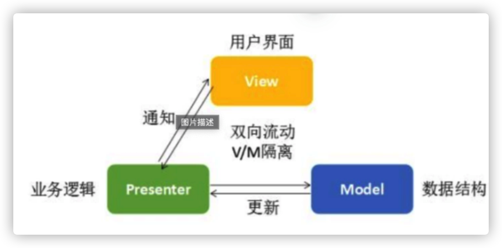

MVP 中的 P 代表展示器。它是一个包含视图的用户界面逻辑的组件。不像 MVC，来自视图的调用被委派给了控制器，它是从视图中解耦出来的，并且转而通过一个接口来同它进行对话。

在 MVP 中，P 观察着模型并且当模型发生改变的时候对视图进行更新（被动视图）。P 切实的将模型绑定到了视图，这一责任在 MVC 中被控制器提前持有了。

## **MVP 模式的优劣**

相较于 MVC 模式，MVP 的好处在于：

- 增强应用的可测试性
- 更加干净的隔离视图和模型

劣势在于：

- 缺乏数据绑定支持

## MVVM

MVVM(Model View ViewModel)是一种基于 MVC 和 MVP 的架构模式，它试图将用户界面（UI）从业务逻辑和行为中更加清晰地分离出来。为了这个目的，很多例子使用声明变量绑定来把 View 层的工作从其他层分离出来。

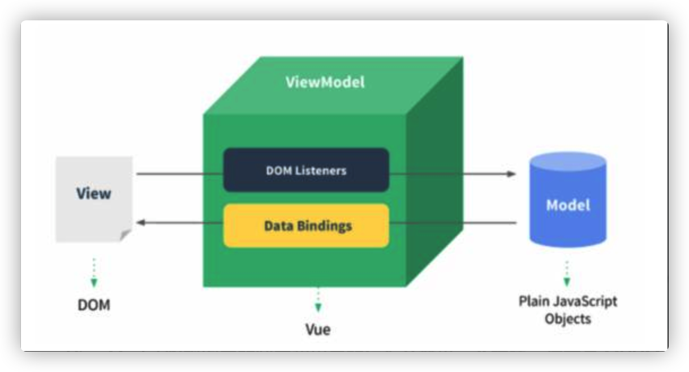

**ViewModel 将视图中的状态和用户的行为分离出一个抽象，这才是 MVVM 的精髓。**

## Virtual DOM

核心：两个对象**最小差异**以及**局部更新DOM**

实现 O(n) 复杂度的关键就是只对比同层的节点，而不是跨层对比，这也是考虑到在实际业务中很少会去跨层的移动 DOM 元素。

- 首先从上至下，从左往右遍历对象，也就是树的深度遍历，这一步中会给每个节点添加索引，便于最后渲染差异
- 一旦节点有子元素，就去判断子元素是否有不同


## 路由原理

1. Hash 模式

[www.test.com/#/](http://www.test.com/#/) 就是 Hash URL，当 # 后面的哈希值发生变化时，可以通过 hashchange 事件来监听到 URL 的变化，从而进行跳转页面，并且无论哈希值如何变化，服务端接收到的 URL 请求永远是 [www.test.com](http://www.test.com/)。

```JS
window.addEventListener('hashchange', () => {
  // ... 具体逻辑
})
```

2. History 模式

History 模式是 HTML5 新推出的功能，主要使用 history.pushState 和 history.replaceState 改变 URL。

通过 History 模式改变 URL 同样不会引起页面的刷新，只会更新浏览器的历史记录。

```jsx
// 新增历史记录
history.pushState(stateObject, title, URL)
// 替换当前历史记录
history.replaceState(stateObject, title, URL)

// 当用户做出浏览器动作时，比如点击后退按钮时会触发 popState 事件
window.addEventListener('popstate', e => {
  // e.state 就是 pushState(stateObject) 中的 stateObject
  console.log(e.state)
})
```

### 两种模式对比

- Hash 模式只可以更改 `#` 后面的内容，History 模式可以通过 API 设置任意的同源 URL
- History 模式可以通过 API 添加任意类型的数据到历史记录中，Hash 模式只能更改哈希值，也就是字符串
- Hash 模式无需后端配置，并且兼容性好。History 模式在用户手动输入地址或者刷新页面的时候会发起 URL 请求，后端需要配置 `index.html` 页面用于匹配不到静态资源的时候

- Hash 模式只可以更改 `#` 后面的内容，History 模式可以通过 API 设置任意的同源 URL
- History 模式可以通过 API 添加任意类型的数据到历史记录中，Hash 模式只能更改哈希值，也就是字符串
- Hash 模式无需后端配置，并且兼容性好。History 模式在用户手动输入地址或者刷新页面的时候会发起 URL 请求，后端需要配置 `index.html` 页面用于匹配不到静态资源的时候

## Vue生命周期钩子函数

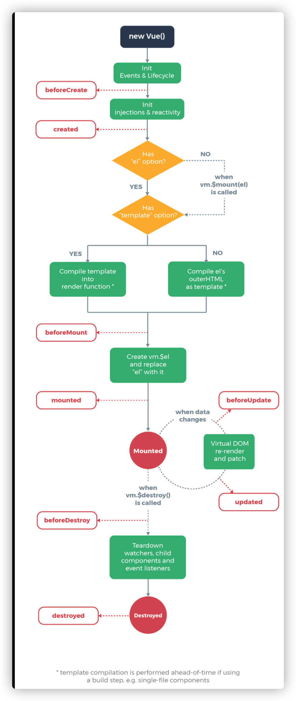

在 `beforeCreate` 钩子函数调用的时候，是获取不到 `props` 或者 `data` 中的数据的，因为这些数据的初始化都在 `initState` 中。

然后会执行 `created` 钩子函数，在这一步的时候已经可以访问到之前不能访问到的数据，但是这时候组件还没被挂载，所以是看不到的。

接下来会先执行 `beforeMount` 钩子函数，开始创建 VDOM，最后执行 `mounted` 钩子，并将 VDOM 渲染为真实 DOM 并且渲染数据。组件中如果有子组件的话，会递归挂载子组件，只有当所有子组件全部挂载完毕，才会执行根组件的挂载钩子。

接下来是数据更新时会调用的钩子函数 `beforeUpdate` 和 `updated`，这两个钩子函数没什么好说的，就是分别在数据更新前和更新后会调用。

最后就是销毁组件的钩子函数 `beforeDestroy` 和 `destroyed`。前者适合移除事件、定时器等等，否则可能会引起内存泄露的问题。然后进行一系列的销毁操作，如果有子组件的话，也会递归销毁子组件，所有子组件都销毁完毕后才会执行根组件的 `destroyed` 钩子函数

keep-alive 独有的生命周期，分别为 activated 和 deactivated 。用 keep-alive 包裹的组件在切换时不会进行销毁，而是缓存到内存中并执行 deactivated 钩子函数，命中缓存渲染后会执行 actived 钩子函数。

## 组件通信

- 父子组件通信： **父组件通过 props 传递数据给子组件，子组件通过 emit 发送事件传递数据给父组件**
- 兄弟组件通信： **通过查找父组件中的子组件实现，也就是 this.$parent.$children，在 $children 中可以通过组件 name 查询到需要的组件实例，然后进行通信。**
- 跨多层级组件通信：**Vue 2.2 新增的 API provide / inject**

```
// 父组件 A
export default {
  provide: {
    data: 1
  }
}
// 子组件 B
export default {
  inject: ['data'],
  mounted() {
    // 无论跨几层都能获得父组件的 data 属性
    console.log(this.data) // => 1
  }
}
```

- 任意组件

这种方式可以通过 Vuex 或者 Event Bus 解决。

## extend

作用是扩展组件生成一个构造器，通常会与 $mount 一起使用

```jsx
// 创建组件构造器
let Component = Vue.extend({
  template: '<div>test</div>'
})
// 挂载到 #app 上
new Component().$mount('#app')
// 除了上面的方式，还可以用来扩展已有的组件
let SuperComponent = Vue.extend(Component)
new SuperComponent({
    created() {
        console.log(1)
    }
})
new SuperComponent().$mount('#app')
```

## mixin 和 mixins 区别

mixin 用于全局混入，会影响到每个组件实例，通常插件都是这样做初始化的。

```jsx
Vue.mixin({
    beforeCreate() {
        // ...逻辑
        // 这种方式会影响到每个组件的 beforeCreate 钩子函数
    }
})
```

mixins最常用的扩展组件方式。多个组件中有相同的业务逻辑，就可以将这些逻辑剥离出来，通过 mixins 混入代码，比如上拉下拉加载数据这种逻辑等等。会先于钩子函数执行。

## computed 和 watch 区别

`computed` 是计算属性，依赖其他属性计算值，并且 `computed` 的值有缓存，只有当计算值变化才会返回内容。

`watch` 监听到值的变化就会执行回调，在回调中可以进行一些逻辑操作。

使用场景：

- computed： 需要依赖别的属性来动态获得值的时候
- watch： 监听到值的变化需要做一些复杂业务逻辑的情况

## keep-alive

如果你需要在组件切换的时候，保存一些组件的状态防止多次渲染，就可以使用 `keep-alive` 组件包裹需要保存的组件。

对于 `keep-alive` 组件来说，它拥有两个独有的生命周期钩子函数，分别为 `activated` 和 `deactivated` 。用 `keep-alive` 包裹的组件在切换时不会进行销毁，而是缓存到内存中并执行 `deactivated` 钩子函数，命中缓存渲染后会执行 `actived` 钩子函数。

## v-show 与 v-if 区别

- v-show 只是在 display: none 和 display: block 之间切换
- v-show 在初始渲染时有更高的开销，但是切换开销很小，更适合于频繁切换的场景。
- v-if 的话就得说到 Vue 底层的编译了。当属性初始为 false 时，组件就不会被渲染，直到条件为 true，并且切换条件时会触发销毁/挂载组件，所以总的来说在切换时开销更高，更适合不经常切换的场景。
- v-if 的这种惰性渲染机制，可以在必要的时候才去渲染组件，减少整个页面的初始渲染开销。

## 组件中 data 什么时候可以使用对象

- 组件复用时候，所有组件实例都会共享data。
- 如果data是对象的话 → 就会造成一个组件修改 data 以后会影响到其他所有组件。
- 需要将 data 写成函数，每次用到就调用一次函数获得新的数据。
- 我们使用 new Vue() 的方式的时候，无论我们将 data 设置为对象还是函数都是可以的，因为 new Vue() 的方式是生成一个根组件，该组件不会复用，也就不存在共享 data 的情况了。

## 响应式原理

Vue 内部使用了 Object.defineProperty() 来实现数据响应式，通过这个函数可以监听到 set 和 get 的事件。

```jsx
var data = { name: 'yck' }
observe(data)
let name = data.name // -> get value
data.name = 'yyy' // -> change value

function observe(obj) {
  // 判断类型
  if (!obj || typeof obj !== 'object') {
    return
  }
  Object.keys(obj).forEach(key => {
    defineReactive(obj, key, obj[key])
  })
}

function defineReactive(obj, key, val) {
  // 递归子属性
  observe(val)
  Object.defineProperty(obj, key, {
    // 可枚举
    enumerable: true,
    // 可配置
    configurable: true,
    // 自定义函数
    get: function reactiveGetter() {
      console.log('get value')
      return val
    },
    set: function reactiveSetter(newVal) {
      console.log('change value')
      val = newVal
    }
  })
}
```

对于自定义函数一开始不会执行，只有执行依赖收集，才能在属性更新的时候派发更新，所以接下来我们需要先触发依赖收集。

```jsx
<div>
    {{name}}
</div>
```

在解析如上模板代码时，遇到 {{name}} 就会进行依赖收集。

实现一个 Dep 类，用于解耦属性的依赖收集和派发更新操作。

```jsx
// 通过 Dep 解耦属性的依赖和更新操作
class Dep {
  constructor() {
    this.subs = []
  }
  // 添加依赖
  addSub(sub) {
    this.subs.push(sub)
  }
  // 更新
  notify() {
    this.subs.forEach(sub => {
      sub.update()
    })
  }
}
// 全局属性，通过该属性配置 Watcher
Dep.target = null
```

依赖收集的时候调用 addSub,派发更新的时候调用 notify。

Vue在组件挂载时，会先对所有需要的属性调用 Object.defineProperty()，然后实例化 Watcher，传入组件更新的回调。在实例化过程中，会对模板中的属性进行求值，触发依赖收集。

简单实现Watcher: 

Watcher 的简单实现，在执行构造函数的时候将 Dep.target 指向自身，从而使得收集到了对应的 Watcher，在派发更新的时候取出对应的 Watcher 然后执行 update 函数。

```jsx
class Watcher {
  constructor(obj, key, cb) {
    // 将 Dep.target 指向自己
    // 然后触发属性的 getter 添加监听
    // 最后将 Dep.target 置空
    Dep.target = this
    this.cb = cb
    this.obj = obj
    this.key = key
    this.value = obj[key]
    Dep.target = null
  }
  update() {
    // 获得新值
    this.value = this.obj[this.key]
    // 调用 update 方法更新 Dom
    this.cb(this.value)
  }
}
```

**defineReactive 函数进行改造,在自定义函数中添加依赖收集和派发更新相关的代码。**

```jsx
function defineReactive(obj, key, val) {
  // 递归子属性
  observe(val)
  let dp = new Dep()
  Object.defineProperty(obj, key, {
    enumerable: true,
    configurable: true,
    get: function reactiveGetter() {
      console.log('get value')
      // 将 Watcher 添加到订阅
      if (Dep.target) {
        dp.addSub(Dep.target)
      }
      return val
    },
    set: function reactiveSetter(newVal) {
      console.log('change value')
      val = newVal
      // 执行 watcher 的 update 方法
      dp.notify()
    }
  })
}
```

- 数据响应式，核心思路就是手动触发一次属性的 getter 来实现依赖收集。
- 测试代码

```jsx
var data = { name: 'yck' }
observe(data)
function update(value) {
  document.querySelector('div').innerText = value
}
// 模拟解析到 `{{name}}` 触发的操作
new Watcher(data, 'name', update)
// update Dom innerText
data.name = 'yyy'
```

## Object.defineProperty 缺陷

如果通过下标方式修改数组数据或者给对象新增属性并不会触发组件的重新渲染，因为 Object.defineProperty 不能拦截到这些操作，更精确的来说，对于数组而言，大部分操作都是拦截不到的，只是 Vue 内部通过重写函数的方式解决了这个问题。

对于Vue提供了一个API → set

```jsx
export function set (target: Array<any> | Object, key: any, val: any): any {
  // 判断是否为数组且下标是否有效
  if (Array.isArray(target) && isValidArrayIndex(key)) {
    // 调用 splice 函数触发派发更新
    // 该函数已被重写
    target.length = Math.max(target.length, key)
    target.splice(key, 1, val)
    return val
  }
  // 判断 key 是否已经存在
  if (key in target && !(key in Object.prototype)) {
    target[key] = val
    return val
  }
  const ob = (target: any).__ob__
  // 如果对象不是响应式对象，就赋值返回
  if (!ob) {
    target[key] = val
    return val
  }
  // 进行双向绑定
  defineReactive(ob.value, key, val)
  // 手动派发更新
  ob.dep.notify()
  return val
}
```

数组而言，Vue 内部重写了以下函数实现派发更新

```jsx
// 获得数组原型
const arrayProto = Array.prototype
export const arrayMethods = Object.create(arrayProto)
// 重写以下函数
const methodsToPatch = [
  'push',
  'pop',
  'shift',
  'unshift',
  'splice',
  'sort',
  'reverse'
]
methodsToPatch.forEach(function (method) {
  // 缓存原生函数
  const original = arrayProto[method]
  // 重写函数
  def(arrayMethods, method, function mutator (...args) {
  // 先调用原生函数获得结果
    const result = original.apply(this, args)
    const ob = this.__ob__
    let inserted
    // 调用以下几个函数时，监听新数据
    switch (method) {
      case 'push':
      case 'unshift':
        inserted = args
        break
      case 'splice':
        inserted = args.slice(2)
        break
    }
    if (inserted) ob.observeArray(inserted)
    // 手动派发更新
    ob.dep.notify()
    return result
  })
})
```

## 模板编译

模板 → AST → render函数

- 第一阶段： 使用正则表达式来匹配模板中的内容，然后将内容提取出来做各种逻辑操作。生成AST。
- 第二阶段：进行有些逻辑判断，判断组件是否只存在于一个，判断是否符合H5规范。 优化AST阶段，对节点进行了静态内容提取，也就是永远你不会变动的节点提取出来。实现复用 Virtual DOM，跳过对比算法的功能。
- 第三阶段：AST生成render函数。主要目的是遍历整个AST，根据不同的条件生成不同的代码。

## NextTick 原理

nextTick 可以让我们在下次 DOM 更新循环结束之后执行延迟回调，用于获得更新后的 DOM。

默认使用microtasks ，特殊情况使用 macrotasks，比如v-on

实现：对于实现 macrotasks ，会先判断是否能使用 setImmediate ，不能的话降级为 MessageChannel ，以上都不行的话就使用 setTimeout

```jsx
if (typeof setImmediate !== 'undefined' && isNative(setImmediate)) {
  macroTimerFunc = () => {
    setImmediate(flushCallbacks)
  }
} else if (
  typeof MessageChannel !== 'undefined' &&
  (isNative(MessageChannel) ||
    // PhantomJS
    MessageChannel.toString() === '[object MessageChannelConstructor]')
) {
  const channel = new MessageChannel()
  const port = channel.port2
  channel.port1.onmessage = flushCallbacks
  macroTimerFunc = () => {
    port.postMessage(1)
  }
} else {
  macroTimerFunc = () => {
    setTimeout(flushCallbacks, 0)
  }
}
```

# React

## 生命周期

### Fiber

1. 虚拟堆栈帧，新的调度器会按照优先级自由调度这些帧，从而将之前的同步渲染改成了异步渲染，在不影响体验的情况下去分段计算更新。
2. React对于动画每16ms暂停一下更新
3. 异步渲染： 两个阶段： reconciliation 和 commit
    - Reconciliation 阶段
        - `componentWillMount`
        - `componentWillReceiveProps` 用getDerivedStateFromProps，函数会在初始化和 update 时被调用
        - `shouldComponentUpdate`  建议使用这个
        - `componentWillUpdate` 用这个代替getSnapshotBeforeUpdate，函数会在 update 后 DOM 更新前被调用，用于读取最新的 DOM 数据。
    - Commit 阶段
        - `componentDidMount`
        - `componentDidUpdate`
        - `componentWillUnmount`

    ## setState

    1. 第一： setState设置为异步，可能是因为DOM的重绘，采用异步进行恰当的更新。
    2. 第二： 多次调用的setState会被合并。

    ## 性能优化

    shouldComponentUpdate 函数中我们可以通过返回布尔值来决定当前组件是否需要更新。

    - immutable和immer库。
    - 简单实用浅比较，PureComponent。
    - React.memo，既实现了 shouldComponentUpdate 的浅比较，又能够使用函数组件。

    ## 通信

    - 父子组件通信
    - 兄弟组件通信
    - 跨多层级组件通信
    - 任意组件

    ### 父子通信

    父组件通过 props 传递数据给子组件，子组件通过调用父组件传来的函数传递数据给父组件。这也就是典型的单向数据流，父组件通过 props 传递数据，子组件不能直接修改 props， 而是必须通过调用父组件函数的方式告知父组件修改数据。

    ### 兄弟组件通信

    通过共同的父组件来管理状态和事件函数，比如说其中一个兄弟组件调用父组件传递过来的事件函数修改父组件中的状态，然后父组件将状态传递给另一个兄弟组件。

    ### 跨多层次组件通信

    Context API

    ```jsx
    // 创建 Context，可以在开始就传入值
    const StateContext = React.createContext()
    class Parent extends React.Component {
      render () {
        return (
          // value 就是传入 Context 中的值
          <StateContext.Provider value='yck'>
            <Child />
          </StateContext.Provider>
        )
      }
    }
    class Child extends React.Component {
      render () {
        return (
          <ThemeContext.Consumer>
            // 取出值
            {context => (
              name is { context }
            )}
          </ThemeContext.Consumer>
        );
      }
    }
    ```

    ### 任意组件

    Redux和Event Bus

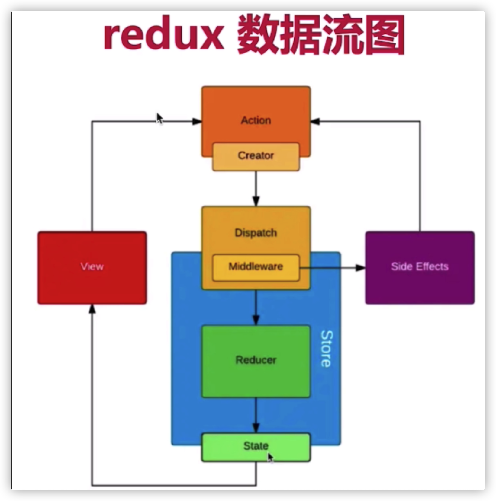
    ## HOC 是什么？相比 mixins 有什么优点？

    HOC叫高阶组件

    ```jsx
    function add(a, b) {
        return a + b
    }

    ||
    ||
    ||
    ||
    ||
    ||

    function withLog (fn) {
        function wrapper(a, b) {
            const result = fn(a, b)
            console.log(result)
            return result
        }
        return wrapper
    }
    const withLogAdd = withLog(add)
    withLogAdd(1, 2)
    ```

    **高阶组件：**我们实现一个函数，传入一个组件，然后在函数内部再实现一个函数去扩展传入的组件，最后返回一个新的组件。

    ## 事件机制

    ```jsx
    const Test = ({ list, handleClick }) => ({
        list.map((item, index) => (
            <span onClick={handleClick} key={index}>{index}</span>
        ))
    })
    ```

    重点：JSX 上写的事件并没有绑定在对应的真实 DOM 上，而是通过事件代理的方式，将所有的事件都统一绑定在了 document 上。这样的方式不仅减少了内存消耗，还能在组件挂载销毁时统一订阅和移除事件。

    document 上的事件也不是原生浏览器事件，而是 React 自己实现的合成事件（SyntheticEvent）。因此我们如果不想要事件冒泡的话，调用 event.stopPropagation 是无效的，而应该调用 event.preventDefault。

    ### 合成事件目的

    - 抹平了浏览器之间的兼容问，一个跨浏览器原生事件包装器，赋予了跨浏览器开发的能力
    - 对于原生浏览器事件来说，浏览器会给监听器创建一个事件对象。如果你有很多的事件监听，那么就需要分配很多的事件对象，造成高额的内存分配问题。但是对于合成事件来说，有一个事件池专门来管理它们的创建和销毁，当事件需要被使用时，就会从池子中复用对象，事件回调结束后，就会销毁事件对象上的属性，从而便于下次复用事件对象。


# Hooks

1. Hooks之前

```jsx
class Welcome extends React.Component {
  render() {
    return <h1>Hello, {this.props.name}</h1>;
  }
}
```

Hooks之后

```jsx
function Welcome(props) {
  return <h1>Hello, {props.name}</h1>;
}
```

## 类和函数

类（class）是数据和逻辑的封装。 函数则是，只应该做一件事，就是返回一个值。如果有多个操作，每个操作应该写成一个单独的函数。而且数据状态应该与操作方法相分离。

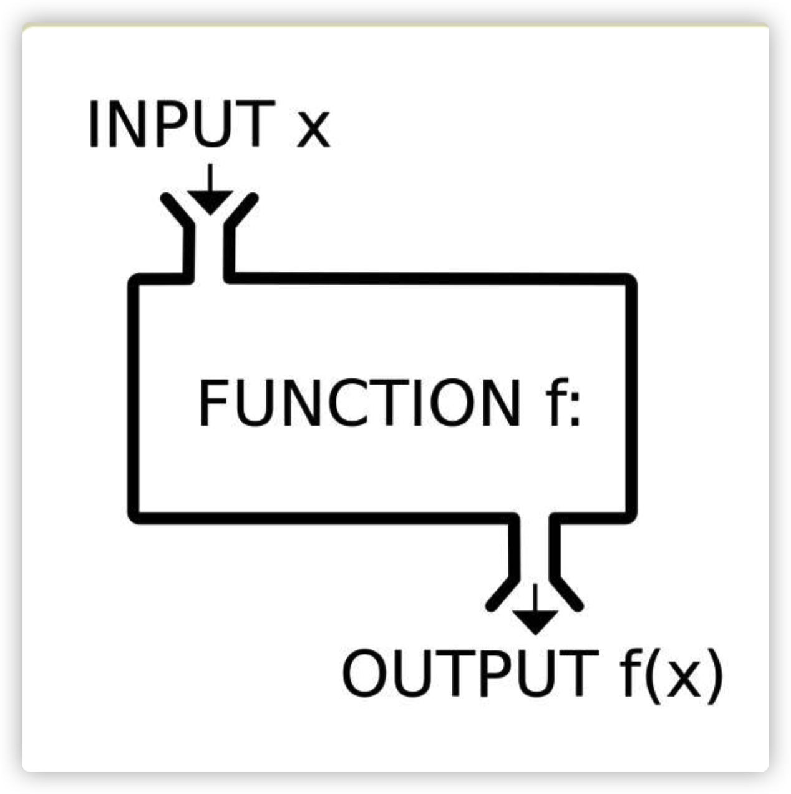
**纯函数： 单纯的数据计算（换算）的函数，在函数式编程里称为纯函数。**

## 副效应

函数式编程将那些跟数据无关的操作，都称为副效应。如果函数内部直接包含产生副效应的操作，就不再是纯函数了。

## Hook作用

一句话，钩子（hook）就是 React 函数组件的副效应解决方案，用来为函数组件引入副效应。

## useEffect用法

useEffect()本身是一个函数。useEffect()的作用就是指定一个副效应函数，组件每渲染一次，该函数就自动执行一次。组件首次在网页 DOM 加载后，副效应函数也会执行。

举例来说，我们希望组件加载以后，网页标题（document.title）会随之改变。那么，改变网页标题这个操作，就是组件的副效应，必须通过useEffect()来实现。

```jsx
import React, { useEffect } from 'react';

function Welcome(props) {
  useEffect(() => {
    document.title = '加载完成';
  });
  return <h1>Hello, {props.name}</h1>;
}
```

### useEffect() 的第二个参数

有的时候我们不希望每次渲染都执行useEffect，这时可以使用它的第二个参数，使用一个数组指定效应函数的依赖项，只有依赖项发生变化，才会重新渲染。

```jsx
function Welcome(props) {
  useEffect(() => {
    document.title = `Hello, ${props.name}`;
  }, [props.name]);
  return <h1>Hello, {props.name}</h1>;
}
```

上面代码，useEffect根据第二个参数的变化而变化，但是如果第二个参数是空数组，那么useEffect只在组件加载进入DOM后执行一次，以后再也不执行了。

## useEffect用途

- 获取数据（data fetching）
- 事件监听或订阅（setting up a subscription）
- 改变 DOM（changing the DOM）
- 输出日志（logging）

## useEffect返回值

Effect()允许返回一个函数，在组件卸载时，执行该函数，清理副效应。如果不需要清理副效应，useEffect()就不用返回任何值。

```jsx
useEffect(() => {
  const subscription = props.source.subscribe();
  return () => {
    subscription.unsubscribe();
  };
}, [props.source]);
```

useEffect()在组件加载时订阅了一个事件，并且返回一个清理函数，在组件卸载时取消订阅。

实际上，每次副效应函数重新执行之前，也会执行一次，用来清理上一次渲染的副效应。

## useEffect注意点

使如果有多个副效应，应该调用多个useEffect()，而不应该合并写在一起

```jsx
function App() {
  const [varA, setVarA] = useState(0);
  const [varB, setVarB] = useState(0);

  useEffect(() => {
    const timeout = setTimeout(() => setVarA(varA + 1), 1000);
    return () => clearTimeout(timeout);
  }, [varA]);

  useEffect(() => {
    const timeout = setTimeout(() => setVarB(varB + 2), 2000);

    return () => clearTimeout(timeout);
  }, [varB]);

  return <span>{varA}, {varB}</span>;
}
```

## useState

1. Hook 对比 class

```jsx
import React, { useState } from 'react';

function Example() {
  // 声明一个叫 "count" 的 state 变量
  const [count, setCount] = useState(0);

  return (
    <div>
      <p>You clicked {count} times</p>
      <button onClick={() => setCount(count + 1)}>
        Click me
      </button>
    </div>
  );
}

| |
| |
| |
| |
| |
| |
| |

class Example extends React.Component {
  constructor(props) {
    super(props);
    this.state = {
      count: 0
    };
  }

  render() {
    return (
      <div>
        <p>You clicked {this.state.count} times</p>
        <button onClick={() => this.setState({ count: this.state.count + 1 })}>
          Click me
        </button>
      </div>
    );
  }
}

// state 初始值为 { count: 0 } ，当用户点击按钮后
// 我们通过调用 this.setState() 来增加 state.count。
```

Class

```jsx
// 设置    
this.state = {
      count: 0
    };
// 获取
 this.state.count
```

Hook

```jsx
// 设置
// 声明一个叫 “count” 的 state 变量
const [count, setCount] = useState(0);

// 获取
<p>You clicked {count} times</p>
```

## 自定义HOOK

**当我们想在两个函数之间共享逻辑时，我们会把它提取到第三个函数中**。而组件和 Hook 都是函数，所以也同样适用这种方式。

**自定义 Hook 是一个函数，其名称以 “use” 开头，函数内部可以调用其他的 Hook。**

```jsx
// 大概
function useFriendStatus(friendID) {
  const [isOnline, setIsOnline] = useState(null);

  // ...

  return isOnline;
}

||
||
||
||
||
||
\/

// 详细
import { useState, useEffect } from 'react';

function useFriendStatus(friendID) {
  const [isOnline, setIsOnline] = useState(null);

  useEffect(() => {
    function handleStatusChange(status) {
      setIsOnline(status.isOnline);
    }

    ChatAPI.subscribeToFriendStatus(friendID, handleStatusChange);
    return () => {
      ChatAPI.unsubscribeFromFriendStatus(friendID, handleStatusChange);
    };
  });

  return isOnline;
}

// 使用自定义hook
function FriendListItem(props) {
  const isOnline = useFriendStatus(props.friend.id);

  return (
    <li style={{ color: isOnline ? 'green' : 'black' }}>
      {props.friend.name}
    </li>
  );
}
```

## 多个Hook 之间传递信息

1. 由于 useState 为我们提供了 recipientID 状态变量的最新值，因此我们可以将它作为参数传递给自定义的 useFriendStatus Hook：

```jsx
const [recipientID, setRecipientID] = useState(1);
const isRecipientOnline = useFriendStatus(recipientID);
```

 2. 如此可以让我们知道当前选中的好友是否在线。当我们选择不同的好友并更新 recipientID 状态变量时，useFriendStatus Hook 将会取消订阅之前选中的好友，并订阅新选中的好友状态。

# CORS

## 两种请求

1. 简单请求和非简单请求

  简单请求：满足以下两大条件，就属于简单请求

- 请求方法是以下三种方法之一：
    - HEAD
    - GET
    - POST
- HTTP的头部信息不超过以下几种字段：
    - Accept
    - Accept-Language
    - Content-Language
    - Last-Event-ID
    - Content-Type：只限于三个值`application/xwww-form-urlencoded`、`multipart/form-data`、`text/plain`

### 简单请求

1. 发送普通ajax请求，添加Origin字段。服务器进行验证Origin字段，成功则添加Access-Control-字段
    - Access-Control-Allow-Origin： 可接受域名范围
    - Access-Control-Allow-Credentials： Cookie是否可发
    - Access-Control-Expose-Headers ： 可选 - 关联XML对象的getResponseHeader()
    - 附加： withCredentials →  发送Cookie → Access-Control-Allow-Credentials: true(服务器)

    开发者：开启 var xhr = new XMLHttpRequest();  xhr.withCredentials = true; 显式关闭xhr.withCredentials = false

## 非简单请求

重点： **预检请求**

**触发请求方法**： PUT 或者DELETE  以及Content-Type字段是application/json

浏览器发现是非简单请求就会发送预检，请求方法“OPTIONS” 。

（服务器检查）**预检请求字段**：

- Origin
- Access-Control-Request-Method ： CORS请求会用到哪些HTTP方法
- Access-Control-Request-Headers： 指定浏览器CORS请求会额外发送的头信息字段
- 注意点：服务器否定了"预检"请求，会返回一个正常的HTTP回应，但是没有任何CORS相关的头信息字段

（HTTP回应）： Access-Control-Allow-Origin

  **服务器回应的其他CORS相关字段**：

```json
Access-Control-Allow-Methods: GET, POST, PUT
Access-Control-Allow-Headers: X-Custom-Header  // 服务器支持的所有头信息字段，不限于预检内的请求字段
Access-Control-Allow-Credentials: true
Access-Control-Max-Age: 1728000
```

后面就和简单请求一样了。

# 跨域方式

### 同源策略

- 协议名 + 域名 + 端口号
- 同源策略的目的：为了保证用户信息的安全，防止恶意的网站窃取数据。
- 限制范围
    - Cookie、LocalStorage 和 IndexDB 无法读取。
    - DOM 无法获得。
    - AJAX 请求不能发送。

## Cookie

- 浏览器允许通过设置document.domain（两个窗口一级域名相同，只是二级域名不同）

## 跨域方式

完全不同源的网站，目前有三种方法，可以解决跨域窗口的通信问题。

```json
片段识别符（fragment identifier）
window.name
跨文档通信API（Cross-document messaging）
```

1. 片段识别符
    - URL的#号后面的部分，比如http://example.com/x.html#fragment的#fragment。如果只是改变片段标识符，页面不会重新刷新。
    - 父窗口可以将信息写入子窗口的片段标识符，子窗口通过hashchange事件得到通知。
2. [window.name](http://window.name/)
    - 父窗口打开一个子窗口，写入不同源网页，将信息保存在window.name中。
    - 子窗口调回一个与主窗口同域的网址
    - 主窗口就可以读取子窗口的window.name了
3. window.postMessage
    - 不同源窗口同postMessage发送消息就可以了。第一个参数具体的信息内容，第二个参数接收消息的窗口的源（origin），即"协议 + 域名 + 端口"。也可以设为*，表示不限制域名，向所有窗口发送。
    - 父子窗口可以通过message事件来监听对方消息。

## ajax跨域

- JSONP： 添加一个<script>元素，向服务器请求JSON数据，这种做法不受同源政策限制；服务器收到请求后，将数据放在一个指定名字的回调函数里传回来。
- WebSocket

    ```json
    GET /chat HTTP/1.1
    Host: server.example.com
    Upgrade: websocket
    Connection: Upgrade
    Sec-WebSocket-Key: x3JJHMbDL1EzLkh9GBhXDw==
    Sec-WebSocket-Protocol: chat, superchat
    Sec-WebSocket-Version: 13
    Origin: http://example.com

    // 服务器端通过Origin字段判断，本次通信的域名是否在白名单内
    // 下面是来自服务器端的允许的返回
    HTTP/1.1 101 Switching Protocols
    Upgrade: websocket
    Connection: Upgrade
    Sec-WebSocket-Accept: HSmrc0sMlYUkAGmm5OPpG2HaGWk=
    Sec-WebSocket-Protocol: chat
    ```

- CORS

## Nginx跨域